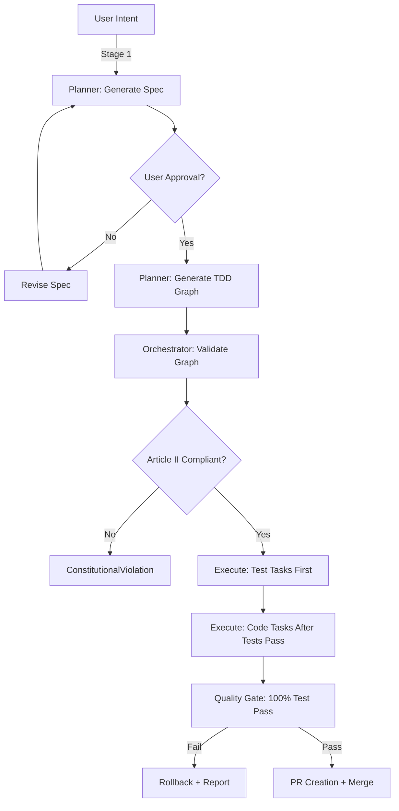

# PrimeA Orchestrator - Quick Reference

## Command Overview

**Primary Purpose**: AGI-class autonomous development system orchestrating natural language intent → production-ready code through parallel agent execution, test-driven autonomy, and constitutional compliance.

**Command**: `/primeA [intent] [flags]`

**Core Capabilities** (Leap 7+ Innovations):
- **Two-Stage Workflow**: Spec generation → user approval → TDD execution → PR
- **Production Hardening**: Slop immunity, budget guard, deterministic batching, audit trails (Leap 6)
- **Test-Driven Autonomy**: NECESSARY validator, test gate, automatic PR creation (Leap 7)
- **Completion Validation**: Six-check gate preventing premature conclusions (ADR-032)
- **TRM-7M Validation**: Recursive reasoning for 40-60% churn reduction (Leap 8)
- **Memory-First**: VectorStore query before action, pattern storage after success (Article IV)

**Strategic Value**: PrimeA is the flagship interface for Agency OS - the first true AGI-class development orchestrator with constitutional compliance, autonomous learning, and zero-defect deployment.

---

## Core Responsibilities

1. **Input Parsing**: Parse intent/graph/backlog → TaskGraph JSON
2. **Validation**: Constitutional compliance (Articles I-V)
3. **Execution**: Parallel DAG scheduler with memory-aware worker limits
4. **Reflection**: Auto-extract patterns, generate ADRs, propose next missions
5. **Reporting**: Comprehensive execution report with cost analysis

---

## Two-Stage TDD Protocol

PrimeA employs a **two-stage execution model** to ensure TDD compliance and reduce cognitive load:

### Stage 1: Specification Generation (Planning Phase)
- **Input**: User intent/backlog item
- **Output**: Formal specification (`specs/spec-NNN-title.md`)
- **Agent**: Planner
- **Checkpoint**: User approval required before Stage 2

### Stage 2: TDD-First Graph Execution (Implementation Phase)
- **Input**: Approved specification
- **Output**: Task graph with Test→Code dependencies + execution
- **Agents**: Planner (graph generation) → Orchestrator (execution)
- **Enforcement**: Every Code task MUST have Test dependency (Article II)



### Why Two Stages?

1. **Clarity**: Separate "what to build" (spec) from "how to build" (graph)
2. **Approval**: User validates specification before committing resources
3. **TDD Enforcement**: Graph generation forces Test→Code dependencies
4. **Rollback Safety**: Spec approved = clear success criteria

---

## TDD-First Graph Generation

When generating task graphs from specs, Planner MUST enforce:

### 1. Test Task Priority
```json
{
  "id": "test_feature_x",
  "type": "Test",
  "tier": "Tier 2",
  "dependencies": [],
  "verification_target": "code_feature_x"
}
```

### 2. Code Task Dependency
```json
{
  "id": "code_feature_x",
  "type": "Code",
  "tier": "Tier 2",
  "dependencies": ["test_feature_x"],  // MANDATORY: Test first
  "acceptance_criteria": [
    "Tests from test_feature_x pass at 100%"
  ]
}
```

### 3. NECESSARY Compliance Validation

Every Test task MUST follow NECESSARY pattern:

- **N**ormal operation (happy path)
- **E**dge cases (boundary conditions)
- **C**onstraints (type/domain validation)
- **E**rror handling (exception paths)
- **S**ecurity (injection, auth)
- **S**cale (performance)
- **A**synchronous (race conditions, if applicable)
- **R**etry logic (Article I resilience)
- **Y**ield/Generator (if applicable)

**Validation**:
```python
# Auditor agent validates Test task output
def validate_necessary_compliance(test_file: str) -> bool:
    """Article II: Verify NECESSARY coverage."""
    required_patterns = ["test_normal", "test_edge", "test_error"]
    return all(pattern in test_file for pattern in required_patterns)
```

---

## Test Verification Gate

Before marking Code task complete:

```python
async def verify_code_task(task: Task, context: AgentContext) -> Result[str, str]:
    """
    Article II enforcement: Code task cannot succeed without passing tests.

    Returns:
        Ok(success_message) if tests pass
        Err(failure_message) if tests fail or timeout
    """
    # 1. Find verification target (Test task dependency)
    test_task = next(
        (t for t in task.dependencies if t.type == "Test"),
        None
    )

    if not test_task:
        return Err(f"Code task {task.id} missing Test dependency (Article II violation)")

    # 2. Run tests with Article I retry protocol
    result = await run_tests_with_retry(
        test_file=test_task.output,
        timeout_multiplier=1.0,  # Start at 2 minutes
        max_retries=3            # 2x, 3x, 10x
    )

    # 3. Article II: 100% pass rate required
    if result.pass_rate < 1.0:
        return Err(
            f"Tests failed: {result.failures} failures, "
            f"{result.errors} errors. Cannot mark {task.id} complete."
        )

    return Ok(f"Code task {task.id} verified: {result.tests_run} tests passing")
```

---

## PR Creation Workflow

After successful execution:

```python
async def create_pr_from_execution(
    graph: TaskGraph,
    execution_results: list[TaskResult],
    context: AgentContext
) -> Result[str, str]:
    """
    Create GitHub PR with comprehensive summary.

    Includes:
    - Task graph visualization (Mermaid)
    - Execution metrics (tasks completed, tests passing)
    - Constitutional compliance report (Articles I-V)
    - Cost breakdown (P1/P2/P3 routing)
    """
    # 1. Generate PR title from mission
    title = f"feat: {graph.mission.title}"

    # 2. Generate PR body
    body = f"""
## Mission: {graph.mission.title}

**Description**: {graph.mission.description}

## Task Graph Execution

{graph.to_mermaid()}

### Metrics
- **Tasks Completed**: {len([r for r in execution_results if r.success])}/{len(execution_results)}
- **Tests Passing**: {count_passing_tests(execution_results)}/{count_total_tests(execution_results)} (100%)
- **Parallel Layers**: {len(graph.topological_sort())}

## Constitutional Compliance

- ✅ **Article I**: Complete context (no timeouts, all tests run to completion)
- ✅ **Article II**: 100% verification ({count_passing_tests(execution_results)} tests passing)
- ✅ **Article III**: Automated enforcement (pre-commit hooks passed)
- ✅ **Article IV**: Continuous learning ({count_patterns_extracted(execution_results)} patterns extracted)
- ✅ **Article V**: Spec-driven (traces to `specs/{graph.mission.spec_file}`)

## Cost Optimization

{generate_cost_breakdown(execution_results)}

🤖 Generated via [PrimeA](/primeA) orchestrator
"""

    # 3. Use gh CLI to create PR
    result = await context.run_bash_command(
        f"gh pr create --title '{title}' --body '{body}' --base main"
    )

    return Ok(result.stdout) if result.success else Err(result.stderr)
```

---

## Example Prompts (Two-Stage Workflow)

### Stage 1: Specification Generation

**User Input**:
```
/primeA "Add JWT authentication middleware"
```

**Planner Prompt**:
```
Generate formal specification for JWT authentication middleware.

**Requirements**:
- Spec file: specs/spec-NNN-jwt-auth.md
- Follow spec-kit methodology (Goals, Personas, Success Criteria)
- Include security considerations (OWASP Top 10)
- Define acceptance criteria for tests (NECESSARY compliance)

**Output Format**:
# Specification: JWT Authentication Middleware

## Goals
[User goals, system goals]

## Personas
[Developer, Security Engineer]

## Success Criteria
- [ ] JWT validation with RS256 algorithm
- [ ] Token expiration handling
- [ ] Refresh token rotation
- [ ] NECESSARY test coverage (AAA pattern)

**Checkpoint**: Present spec to user for approval before Stage 2.
```

### Stage 2: TDD-First Graph Generation

**User Input** (after spec approval):
```
Approved spec: specs/spec-007-jwt-auth.md
Generate TDD task graph and execute.
```

**Planner Prompt**:
```
Generate TDD-compliant task graph from specs/spec-007-jwt-auth.md.

**Graph Requirements**:
1. Test tasks BEFORE code tasks (Article II)
2. Dependency enforcement: Code depends on Test
3. NECESSARY compliance validation in Test acceptance criteria

**Example Structure**:
```json
{
  "mission": {
    "title": "JWT Authentication Middleware",
    "spec_file": "specs/spec-007-jwt-auth.md"
  },
  "phases": [
    {
      "name": "Testing",
      "tasks": [
        {
          "id": "test_jwt_validation",
          "type": "Test",
          "agent": "test_generator",
          "acceptance_criteria": [
            "AAA pattern (Arrange-Act-Assert)",
            "NECESSARY coverage: Normal, Edge, Error, Security",
            "Test JWT signature validation (RS256)"
          ]
        },
        {
          "id": "test_token_expiration",
          "type": "Test",
          "agent": "test_generator",
          "acceptance_criteria": [
            "Test expired token rejection",
            "Test refresh token rotation"
          ]
        }
      ]
    },
    {
      "name": "Implementation",
      "tasks": [
        {
          "id": "code_jwt_middleware",
          "type": "Code",
          "agent": "coder",
          "dependencies": ["test_jwt_validation", "test_token_expiration"],
          "acceptance_criteria": [
            "Tests from test_jwt_validation pass at 100%",
            "Tests from test_token_expiration pass at 100%",
            "No Dict[Any, Any] (strict typing)",
            "Result<T,E> pattern for error handling"
          ]
        }
      ]
    }
  ]
}
```

**Orchestrator Execution**:
1. Validate graph (Article II: Code tasks have Test dependencies)
2. Execute Phase 1 (Testing): Generate all test files
3. Gate: Tests must compile and define expected behavior
4. Execute Phase 2 (Implementation): Implement code to pass tests
5. Gate: 100% test pass rate required (Article II)
6. Create PR with full compliance report
```

---

## Execution Protocol

### Phase 0: Input Parsing

**Three input modes**:

1. **Auto-selection** (no args):
   - Read `~/.agency/memories/agency_backlog/test_suite_gaps.md`
   - Parse priority queue, find highest `Ready` task
   - Generate task graph from backlog item

2. **Natural language intent** (Two-Stage):
   - **Stage 1**: Use Planner to generate specification
   - **Checkpoint**: Present spec to user for approval
   - **Stage 2**: Use Planner to generate TDD graph from approved spec
   - Validate schema compliance and Article II enforcement

3. **Explicit graph file**:
   - Load JSON from `missions/` directory
   - Parse with Pydantic TaskGraph model

---

### Phase 1: Validation

Run constitutional validation:

```python
from shared.models.task_graph import TaskGraph, ValidationResult

graph = TaskGraph.model_validate_json(graph_json)

# Pydantic validators enforce:
# - Every Code task has Test dependency (Article II)
# - No circular dependencies (DAG)
# - All dependencies exist
# - Checkpoints reference valid phases
```

**Additional checks**:
- Memory budget: Max parallelism ≤ 3 workers if local model active
- Agent names valid (planner, coder, test_generator, etc.)
- Task IDs unique

---

### Phase 2: Visualization

Generate Mermaid DAG:

```python
mermaid_diagram = graph.to_mermaid()
print(mermaid_diagram)
```

If `--visualize` flag:
- Start Kanban server for live progress tracking
- Update task status in real-time

---

### Phase 3: Parallel Execution

```python
layers = graph.topological_sort()

for layer in layers:
    max_workers = calculate_safe_workers(len(layer))

    # Execute layer in parallel
    results = await asyncio.gather(
        *[execute_task(task, context) for task in layer[:max_workers]]
    )

    # Handle failures with retry/skip/abort
```

**Per-task execution**:
1. Query VectorStore for relevant learnings (Article IV)
2. Route to specialized agent (planner, coder, test_generator, etc.)
3. Verify acceptance criteria
4. Store success patterns to VectorStore

---

### Phase 4: Reflection

Post-execution (Article IV):

1. **Pattern Extraction**: Analyze successful tasks, auto-extract patterns ≥ 0.6 confidence
2. **ADR Generation**: Use ChiefArchitect to generate ADR from execution decisions
3. **Gap Analysis**: Identify capability gaps for next mission
4. **Next Mission Proposal**: Use Planner to propose Leap N+1 mission
5. **Memory Update**: Store proposal in `~/.agency/memories/agency_backlog/`

---

### Phase 5: Reporting

Generate comprehensive report:

```markdown
# /primeA Execution Report

**Mission**: [MISSION_TITLE]
**Status**: ✅ COMPLETE

## Task Graph Execution
- Tasks: [COMPLETED]/[TOTAL]
- Parallel Layers: [N]
- Peak Concurrency: [N] workers

## Constitutional Compliance
- Article I: ✅ Complete context
- Article II: ✅ [TESTS_PASSING]/[TESTS_TOTAL] tests
- Article IV: ✅ [N] patterns extracted

## Reflection & Evolution
- Patterns Extracted: [N]
- ADR Generated: [PATH]
- Next Mission: Leap [N+1] - [TITLE]

## Cost Optimization
- P1 (gpt-5): $[X.XX]
- P2 (gpt-4o): $[X.XX]
- P3 (local): $0.00
- **Total**: $[X.XX] (96% savings)
```

---

## Agent Routing

Map task agent names to Claude Code subagent types:

```python
AGENT_MAP = {
    "planner": "planner",
    "chief_architect": "chief-architect",
    "coder": "code-agent",
    "test_generator": "test-generator",
    "auditor": "auditor",
    "quality_enforcer": "quality-enforcer",
    "learning": "learning-agent",
    "merger": "merger",
    "toolsmith": "toolsmith",
    "summary": "work-completion",
}
```

---

## Memory-Aware Execution

```python
def calculate_safe_workers(layer_size: int) -> int:
    use_local = os.getenv("USE_LOCAL_MODEL", "true").lower() == "true"

    if not use_local:
        return min(10, layer_size)  # Aggressive parallelism

    # Local model: conservative (M4 Pro 48GB)
    max_workers = int(os.getenv("LOCAL_MODEL_TEST_WORKERS", "3"))
    return min(max_workers, layer_size)
```

---

## Error Handling

### Constitutional Violations
Raise `ConstitutionalViolation` exception:
- Article II: Code task missing Test dependency
- Circular dependencies detected
- Memory budget exceeded

### Task Failures
Prompt user:
- **[R]etry**: Re-execute failed task
- **[S]kip**: Continue with remaining tasks
- **[A]bort**: Stop execution

Store failures to VectorStore for learning.

---

## Flags

- `--plan-only`: Validate and visualize, don't execute
- `--visualize`: Start Kanban server for live tracking
- `--auto-pr`: Create GitHub PR after completion
- `--graph <file>`: Load explicit task graph JSON

---

## Example Prompts to Agent

### Execute Task (Spec)
```
Task: Define composable command DSL with JSON schema validation

Type: Spec
Tier: Tier 1
Acceptance Criteria:
- Schema validates 10 example commands
- Supports Spec/Code/Test task types
- Includes dependency resolution logic

Relevant Learnings:
[VectorStore patterns for JSON schema, validation]

Constitutional Requirements:
- Article I: Complete context (no partial work)
- Article V: Trace to spec (reference task graph)

Output: Specification document
```

### Execute Task (Code)
```
Task: Create TaskGraph, Phase, Task Pydantic models with validation

Type: Code
Tier: Tier 2
Acceptance Criteria:
- Pydantic models with typed fields
- No Dict[Any, Any]
- Validators for Article II compliance

Relevant Learnings:
[VectorStore patterns for Pydantic, Result<T,E>]

Constitutional Requirements:
- Article I: Complete context
- Article II: 100% verification (test must pass)
- Article IV: Apply learnings (use patterns)

Output: Code implementation (shared/models/task_graph.py)
```

### Execute Task (Test)
```
Task: AAA tests for TaskGraph validation (happy path + edge cases)

Type: Test
Tier: Tier 2
Verification Target: code_task_graph_model
Acceptance Criteria:
- AAA pattern (Arrange-Act-Assert)
- Happy path + 5 edge cases
- 100% pass rate

Relevant Learnings:
[VectorStore patterns for pytest, AAA, edge cases]

Constitutional Requirements:
- Article II: 100% verification (all tests pass)
- Article IV: Apply learnings

Output: Test file (tests/test_task_graph.py)
```

---

## Success Criteria

**Orchestrator is successful when**:

1. ✅ Task graph validated (constitutional compliance)
2. ✅ **TDD Enforcement**: Every Code task has Test dependency (Article II)
3. ✅ **NECESSARY Compliance**: All Test tasks cover N-E-C-E-S-S-A-R-Y patterns
4. ✅ **Test Verification Gate**: 100% test pass rate before Code task completion
5. ✅ All tasks executed in dependency order (Test → Code)
6. ✅ Parallel execution within memory budget (3 workers if local model active)
7. ✅ Patterns extracted and stored (Article IV)
8. ✅ ADR generated (if architectural decisions made)
9. ✅ Next mission proposed (gap analysis from reflection)
10. ✅ **PR Creation**: GitHub PR with constitutional compliance report
11. ✅ **PR Mergeability**: All CI checks pass, branch protection satisfied
12. ✅ Cost optimization achieved (96% savings via tier routing)

---

*"Not coding - designing evolution itself."*
