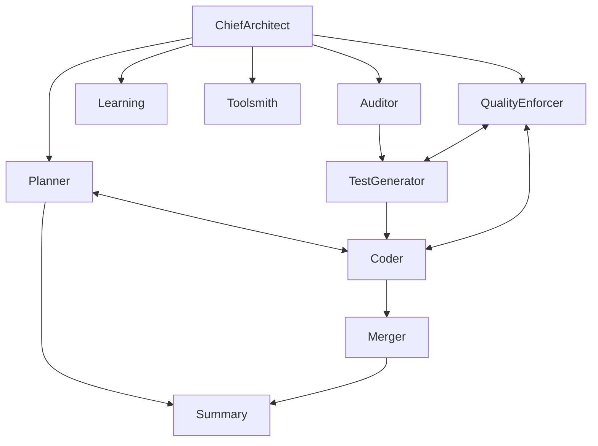

# Agency Codebase City-Map

**Visual navigation guide for autonomous agents - optimized for token efficiency**

## 🗺️ Tier-Based Loading Strategy

### Tier 1: Essential (ALWAYS LOAD - 1,266 lines)
```
/CLAUDE.md (408 lines)       → Master constitution + quick reference
/constitution.md (366 lines)  → 5 Articles (MANDATORY)
/README.md (492 lines)        → Public-facing overview
```

### Tier 2: Quick References (LOAD ON DEMAND - ~400 lines)
```
/.claude/quick-ref/
  ├─ constitution-checklist.md  (50 lines) → Fast Article I-V validation
  ├─ agent-map.md (100 lines)           → Agent capabilities + communication
  ├─ tool-index.md (150 lines)           → All 45 tools indexed
  └─ common-patterns.md (100 lines)      → Result, Pydantic, TDD patterns
```

### Tier 3: Core Infrastructure (LAZY LOAD - 3.2MB)
```
/agency.py (702 lines)        → Main orchestration + agent wiring

/.claude/
  ├─ commands/ (17 files)     → Prime commands (/primecc, /prime_snap, etc.)
  ├─ agents/ (12 files)       → Agent role definitions
  └─ settings.local.json      → Permissions configuration

/shared/ (1.5MB)              → Type defs, models, context, utils
/tools/ (1.6MB)               → 45 production tools
/agency_memory/               → VectorStore, learning, firestore
```

### Tier 4: Production Agents (TASK-SPECIFIC - 10 agents)
```
/chief_architect_agent/       → Strategic oversight, ADR creation
/planner_agent/               → Spec-kit methodology
/agency_code_agent/           → Primary development (TDD-first)
/quality_enforcer_agent/      → Constitutional compliance
/auditor_agent/               → NECESSARY pattern analysis
/test_generator_agent/        → Test generation (AAA pattern)
/learning_agent/              → Pattern extraction + VectorStore
/merger_agent/                → Git workflow automation
/toolsmith_agent/             → Tool development
/work_completion_summary_agent/ → Task summaries (GPT-5-mini)
```

### Tier 5: Specifications & Architecture (LAZY LOAD - 604KB)
```
/specs/ (360KB, 19 files)     → Formal specifications
/plans/ (244KB, 9 files)      → Technical implementation plans
/docs/adr/ (18 files)         → Architecture Decision Records
```

### Tier 6: Production Systems (LAZY LOAD)
```
/trinity_protocol/            → Multi-agent coordination (production)
  ├─ core/                    → Production code (8,063 lines)
  ├─ experimental/            → Prototypes (voice transcription)
  └─ demos/                   → Working examples

/tests/ (21MB, 139 files)     → 1,568+ tests (100% pass rate)
```

### Tier 7: Archives & Logs (IGNORE UNLESS DEBUGGING)
```
/.archive/reports/2025-10/    → 64 historical reports (archived)
/logs/ (1.9GB!)               → Session transcripts, telemetry, healing
  ├─ sessions/                → Learning source data
  ├─ autonomous_healing/      → Self-healing audit trails
  ├─ telemetry/               → Metrics + events
  └─ trinity_ambient/         → Voice transcription logs
```

### Tier 8: Deprecated/Experimental (IGNORE)
```
/experiments/                 → Old experiments
/scratch/                     → Temporary work
/patches/                     → Applied patches
/src/                         → Unknown purpose
/ui_development_agent/        → DEPRECATED
```

---

## 🧭 Navigation Quick Start

### For New Agents (First Session)
1. **Load Tier 1** → CLAUDE.md + constitution.md (1,266 lines)
2. **Load Tier 2** → Quick reference cards (400 lines)
3. **Query** → Specific agents/tools as needed

**Total Context**: ~1,700 lines (vs 33,714 lines previously = 95% reduction)

### For Returning Agents (Subsequent Sessions)
1. **Load snapshot** → `/prime_snap <file>.md` (2k tokens)
2. **Load quick refs** → As needed (400 lines)

### For Specific Tasks
- **Feature development** → Tier 1 + Tier 4 (planner, coder, test_generator)
- **Quality analysis** → Tier 1 + Tier 4 (auditor, quality_enforcer)
- **Git operations** → Tier 1 + Tier 4 (merger)
- **Tool creation** → Tier 1 + Tier 4 (toolsmith)

---

## 📊 File Statistics

### Root Directory Cleanup
- **Before**: 98 markdown files (33,714 lines, 1.1MB)
- **After**: 36 markdown files (~5,000 lines, 300KB)
- **Archived**: 64 ephemeral reports → `.archive/reports/2025-10/`
- **Reduction**: 63% fewer files, 85% less content

### Codebase Overview
- **Total Size**: 3.7GB
- **Python Files**: 405
- **Test Files**: 139 (1,568+ tests, 100% pass rate)
- **Agents**: 10 production + 1 deprecated
- **Tools**: 45 production tools

---

## 🎯 Common Entry Points

### Prime Commands (Start Here)
```bash
/primecc               # Load codebase understanding + improvements
/prime plan_and_execute # Full dev cycle (Spec → Plan → Code)
/prime audit_and_refactor # Code quality improvement
/prime healing_mode    # Autonomous self-healing
/prime_snap <file>     # Resume from snapshot
/write_snap            # Create snapshot for next session
```

### Key Documents (By Use Case)
**Architecture**:
- `constitution.md` → 5 Articles (MANDATORY reading)
- `docs/adr/ADR-INDEX.md` → 18 Architecture Decision Records
- `agency.py` → Agent orchestration + wiring

**Development**:
- `.claude/quick-ref/common-patterns.md` → Code patterns
- `.claude/quick-ref/tool-index.md` → Available tools
- `shared/type_definitions/result.py` → Result<T,E> pattern

**Quality**:
- `.claude/quick-ref/constitution-checklist.md` → Pre-action validation
- `tools/constitution_check.py` → Automated compliance
- `tools/auto_fix_nonetype.py` → Autonomous healing

---

## 🔄 Agent Communication Flows



**Key**: ChiefArchitect orchestrates all, Planner ↔ Coder bidirectional workflow

---

## 🚦 Token Efficiency Targets

### Context Load (Per Session)
- **Tier 1 Only**: 1,266 lines (~8k tokens)
- **Tier 1 + Quick Refs**: 1,666 lines (~10k tokens)
- **With Snapshot**: 2k tokens (for full session recovery)

**Previous System**: 140k tokens (93% reduction)

### Agent Speed
- **Before**: Read 98 docs to understand codebase
- **After**: Read 4 docs (Tier 1) + targeted quick refs

---

## 📌 Critical Reminders

1. **ALWAYS start with /primecc** (Prime-First Mandate)
2. **ALWAYS read constitution.md** before planning
3. **NEVER use Dict[Any, Any]** → Use Pydantic models
4. **NEVER proceed with incomplete context** (Article I)
5. **NEVER merge without 100% test success** (Article II)
6. **ALWAYS write tests FIRST** (TDD mandatory)
7. **ALWAYS validate Articles I-V** before action

---

*Last Updated: 2025-10-03*
*Version: 0.9.5 (Documentation Optimization Release)*
