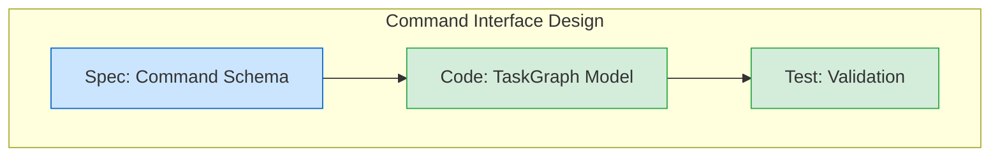

# `/primeA` - The Autopoietic Orchestrator

**AgencyOS Intelligence Layer - Meta-Evolution Architecture**

---

## Executive Summary

`/primeA` (Prime AgencyOS) is the next evolution of autonomous orchestration, transforming linear task execution into **declarative task graph intelligence** with parallel execution, real-time reflection, and self-evolution.

**Key Innovation**: From "do task X, then Y" → "here's the outcome I want, figure out the optimal execution path"

---

## Core Transformation

### Before (`/primeccc`)
```
Strategic Intent → Plan → Execute (linear) → Report
```
- ✅ Memory-optimized (10k tokens)
- ✅ Auto-selects from backlog
- ✅ Constitutional compliance
- ❌ **Linear execution** (no parallelism)
- ❌ **No self-reflection** (manual learning extraction)
- ❌ **No task graph visualization**
- ❌ **No adaptive routing** (static P1/P2/P3)

### After (`/primeA`)
```
Intent/Graph → Validate → Visualize → Execute (parallel DAG) → Reflect → Evolve
```
- ✅ **Task graph DSL** (declarative mission specification)
- ✅ **Parallel DAG execution** (3 workers, memory-aware)
- ✅ **Auto-reflection** (pattern extraction, ADR generation)
- ✅ **Adaptive routing** (learn from execution history)
- ✅ **Real-time visualization** (Mermaid + Kanban)
- ✅ **Self-evolution** (auto-propose next missions)
- ✅ **Constitutional compliance** (Articles I-V at every node)

---

## Architecture Layers

### 1. Input Layer (Three Modes)

**Mode A: Auto-Selection** (no arguments)
```bash
$ /primeA

🎯 Auto-selected from backlog:
   Priority #1: Ollama Docker Compose Setup
   Value: High | Effort: 1-2h | ROI: 🔥 Highest
```

**Mode B: Natural Language Intent**
```bash
$ /primeA "Build composable command library with JSON schema validation"

📝 Generating task graph from intent...
✅ Task Graph: 8 tasks across 3 phases
```

**Mode C: Explicit Graph File**
```bash
$ /primeA --graph missions/leap_2_smart_factory.json

📂 Loading task graph...
✅ Validated: 15 tasks, 3 phases, 2 checkpoints
```

---

### 2. Planning Layer (Task Graph Intelligence)

**Task Graph Schema**:
```typescript
interface TaskGraph {
  mission: string;
  leap_number?: number;
  phases: Phase[];      // Sequential groups
  checkpoints?: Checkpoint[];
  metadata?: {
    estimated_tokens?: number;
    estimated_cost_usd?: number;
    complexity?: "simple" | "moderate" | "complex";
  };
}

interface Task {
  id: string;           // Unique identifier
  title: string;        // Human-readable
  type: "Spec" | "Code" | "Test";
  tier: "Tier 1" | "Tier 2";  // P1 or P2/P3
  agent: string;        // planner, coder, etc.
  description: string;  // Actionable instruction
  dependencies: string[];  // Task IDs
  acceptance_criteria?: string[];
  verification_target?: string;  // For Test tasks
}
```

**Example Task Graph** (JSON):
```json
{
  "mission": "Leap 2 - Smart Factory: Phase 1",
  "leap_number": 2,
  "phases": [
    {
      "id": "phase_1_design",
      "title": "Command Interface Design",
      "tasks": [
        {
          "id": "spec_command_interface",
          "title": "Spec: Command JSON Schema",
          "type": "Spec",
          "tier": "Tier 1",
          "agent": "chief_architect",
          "description": "Define composable command DSL",
          "dependencies": [],
          "acceptance_criteria": [
            "Schema validates 10 example commands"
          ]
        },
        {
          "id": "code_task_graph_model",
          "title": "Implement TaskGraph Model",
          "type": "Code",
          "tier": "Tier 2",
          "agent": "coder",
          "description": "Create Pydantic models",
          "dependencies": ["spec_command_interface"]
        },
        {
          "id": "test_task_graph_model",
          "title": "Test TaskGraph Validation",
          "type": "Test",
          "tier": "Tier 2",
          "agent": "test_generator",
          "description": "AAA tests for validation",
          "dependencies": ["code_task_graph_model"],
          "verification_target": "code_task_graph_model"
        }
      ]
    }
  ]
}
```

**Constitutional Validation** (Automatic):
- ✅ Every Code task has Test dependency (Article II)
- ✅ No circular dependencies (DAG validation)
- ✅ All dependencies exist
- ✅ Memory budget check (max 3 workers with local model)

---

### 3. Execution Layer (Parallel DAG Scheduler)

**Topological Sort** → Parallelizable Layers:
```python
# Example graph
Spec A
  ├→ Code B
  ├→ Code C  (parallel)
  │   └→ Test D
  └→ Test E

# Becomes layers:
Layer 1: [Spec A]
Layer 2: [Code B, Code C]       # Execute in parallel (2 workers)
Layer 3: [Test D, Test E]       # Execute in parallel (2 workers)
```

**Memory-Aware Worker Calculation**:
```python
def calculate_safe_workers(layer_size: int) -> int:
    use_local = os.getenv("USE_LOCAL_MODEL", "true") == "true"

    if not use_local:
        return min(10, layer_size)  # Cloud-only: aggressive

    # Local model active: conservative
    # 48GB - 37GB (model+KV) - 5GB (safety) = 6GB / 3GB per worker = 2 safe
    return min(3, layer_size)  # Max 3 workers
```

**Execution Flow**:
```python
async def execute_task_graph(graph, context):
    layers = graph.topological_sort()  # Parallelizable groups

    for layer in layers:
        max_workers = calculate_safe_workers(len(layer))

        # Spawn tasks in parallel (within memory budget)
        results = await asyncio.gather(
            *[execute_task(task, context) for task in layer[:max_workers]]
        )

        # Handle errors, update visualization, store learnings
```

**Per-Task Execution**:
```python
async def execute_task(task, context):
    # 1. Query learnings (Article IV)
    learnings = context.search_memories([task.type, "pattern"])

    # 2. Adaptive model routing (learn from history)
    model = get_optimal_model_for_task(task, learnings)

    # 3. Spawn specialized agent
    result = await Task(
        subagent_type=task.agent,
        description=task.title,
        prompt=f"""
Task: {task.description}
Learnings: {format_learnings(learnings)}
Constitutional Requirements: Articles I-V
"""
    )

    # 4. Verify acceptance criteria
    verify_acceptance_criteria(result, task.acceptance_criteria)

    # 5. Store success pattern (Article IV)
    context.store_memory(
        key=f"success_{task.id}",
        content={"task": task.dict(), "result": result, "model": model},
        tags=["success", "pattern"]
    )

    return result
```

---

### 4. Reflection Layer (Meta-Learning)

**Post-Execution Analysis**:
```python
async def post_execution_reflection(graph, execution_result, context):
    # 1. Extract patterns from successful tasks
    patterns = [
        analyze_task_for_patterns(r) for r in execution_result.results
        if r.status == "success"
    ]

    # 2. Store to VectorStore (Article IV)
    for pattern in patterns:
        context.store_memory(f"pattern_{pattern.name}", pattern.dict())

    # 3. Auto-generate ADR
    adr = await Task(
        subagent_type="chief-architect",
        prompt="Generate ADR from execution decisions"
    )

    # 4. Analyze capability gaps
    gaps = identify_capability_gaps(execution_result)

    # 5. Propose next mission (Leap N+1)
    next_mission = await Task(
        subagent_type="planner",
        prompt=f"Propose Leap {graph.leap_number + 1} based on gaps: {gaps}"
    )

    # 6. Update Memory Tool backlog
    tool.create(f"/memories/agency_backlog/leap_{graph.leap_number+1}.md", next_mission)

    return ReflectionReport(
        patterns_extracted=len(patterns),
        adr_generated=adr.path,
        next_mission=next_mission.title
    )
```

**Outputs**:
- ✅ Patterns stored in VectorStore (cross-session learning)
- ✅ ADR auto-generated (`docs/adr/ADR-XXX.md`)
- ✅ Next mission proposal in backlog
- ✅ Capability gaps documented

---

### 5. Evolution Layer (Self-Improvement)

**Adaptive Model Routing**:
```python
class AdaptiveModelRouter:
    def classify_task(self, task: Task) -> str:
        # Check VectorStore for similar past tasks
        similar = context.search_memories(
            tags=["task_execution", task.type],
            query=task.description
        )

        if similar:
            avg_quality = mean([t.metadata["quality_score"] for t in similar])
            avg_model = mode([t.metadata["model_used"] for t in similar])

            # If gpt-4o achieved 95%+ quality, use it instead of gpt-5
            if avg_model == "gpt-4o" and avg_quality >= 0.95:
                return "P2"  # Cheaper model

        # Fallback to static classification
        return classify_task_complexity(task.description)
```

**Learning Feedback Loop**:
```
Execution → Success/Failure → Store Outcome → Query Before Next Task → Adapt Routing
```

**Template Library Refinement**:
```python
# Templates improve from execution learnings
TASK_TEMPLATES = {
    "code_pydantic": {
        "type": "Code",
        "tier": "Tier 2",
        "boilerplate": "from pydantic import BaseModel",
        "patterns": ["No Dict[Any, Any]", "Result<T,E> for errors"],
        # ↓ Updated from learnings
        "success_rate": 0.95,
        "avg_model": "local"  # Learned: P3 task works locally
    }
}
```

---

### 6. Visualization Layer (Real-Time Progress)

**Mermaid DAG**:


**Live Updates**:
- ⚪ Pending (gray)
- 🟡 In Progress (yellow)
- 🟢 Completed (green)
- 🔴 Failed (red)

**Kanban Integration** (optional):
```bash
$ /primeA --visualize

[Kanban UI opens at localhost:8080]

Columns: Pending | In Progress | Completed
Real-time task movement as execution proceeds
```

---

## Command Usage

### Basic Usage
```bash
# Auto-select from backlog
/primeA

# Natural language intent
/primeA "Add JWT authentication with refresh tokens"

# Load pre-defined graph
/primeA --graph missions/leap_2_smart_factory.json
```

### Flags
```bash
--plan-only          # Stop after validation, review graph before execution
--visualize          # Show real-time Mermaid DAG or Kanban UI
--auto-pr            # Auto-create PR after completion
--compose            # Compose from templates
```

### Compose Mode
```bash
/primeA compose feature_auth using [spec_feature, code_pydantic, test_unit]

# Generates task graph:
# 1. spec_feature → Spec task with acceptance criteria template
# 2. code_pydantic → Code task with Pydantic boilerplate
# 3. test_unit → Test task with AAA pattern
```

---

## Execution Example

### Input
```bash
$ /primeA --graph missions/leap_2_phase_1_example.json --visualize
```

### Output
```
📂 Loading task graph: missions/leap_2_phase_1_example.json
✅ Validated: 11 tasks, 3 phases, 2 checkpoints

📊 Task Graph Summary:
- Mission: Leap 2 - Smart Factory: Phase 1 Composable Command Library
- Complexity: complex
- Estimated Cost: $2.40

[Mermaid DAG displayed]

🚦 Proceed with execution? Y

━━━━━━━━━━━━━━━━━━━━━━━━━━━━━━━━━━━━━━━━━━━━
Phase 1/3: Command Interface Design (3 tasks)
━━━━━━━━━━━━━━━━━━━━━━━━━━━━━━━━━━━━━━━━━━━━

Layer 1: spec_command_interface
  🤖 Spawning chief_architect (Tier 1, gpt-5)...
  ✅ Complete (3.2s, 2,847 tokens)

Layer 2: code_task_graph_model
  🤖 Spawning coder (Tier 2, local)...
  ✅ Complete (1.8s, 3,124 tokens, $0.00)

Layer 3: test_task_graph_model
  🤖 Spawning test_generator (Tier 2, local)...
  ✅ Complete (2.1s, 2,956 tokens, $0.00)

🚦 Checkpoint: Review TaskGraph Pydantic models...
Continue? Y

━━━━━━━━━━━━━━━━━━━━━━━━━━━━━━━━━━━━━━━━━━━━
Phase 2/3: DAG Scheduler Implementation (5 tasks)
━━━━━━━━━━━━━━━━━━━━━━━━━━━━━━━━━━━━━━━━━━━━

Layer 1: spec_parallel_execution
  ✅ Complete (planner, Tier 1, gpt-5, 2.8s)

Layer 2: code_topological_sort, code_parallel_executor
  [Parallel: 2 workers]
  ✅ code_topological_sort (coder, Tier 2, local, 1.5s)
  ✅ code_parallel_executor (coder, Tier 2, gpt-4o, 3.2s)

Layer 3: test_topological_sort, test_parallel_executor
  [Parallel: 2 workers]
  ✅ test_topological_sort (test_generator, Tier 2, local, 1.9s)
  ✅ test_parallel_executor (test_generator, Tier 2, local, 2.3s)

━━━━━━━━━━━━━━━━━━━━━━━━━━━━━━━━━━━━━━━━━━━━
Phase 3/3: Real-Time Visualization (2 tasks)
━━━━━━━━━━━━━━━━━━━━━━━━━━━━━━━━━━━━━━━━━━━━

Layer 1: code_mermaid_renderer
  ✅ Complete (coder, Tier 2, local, 1.2s)

Layer 2: test_mermaid_renderer
  ✅ Complete (test_generator, Tier 2, local, 0.9s)

━━━━━━━━━━━━━━━━━━━━━━━━━━━━━━━━━━━━━━━━━━━━
🧠 Reflection & Evolution
━━━━━━━━━━━━━━━━━━━━━━━━━━━━━━━━━━━━━━━━━━━━

🔍 Extracting patterns from execution...
✅ Stored 4 new patterns:
  - pydantic_validation_pattern (confidence: 0.92)
  - dag_topological_sort_pattern (confidence: 0.88)
  - parallel_executor_pattern (confidence: 0.95)
  - mermaid_visualization_pattern (confidence: 0.90)

📄 Generating ADR...
✅ ADR-025: Leap 2 Phase 1 Learnings
   Saved to: docs/adr/ADR-025.md

🚀 Proposing next mission...
✅ Leap 3 - Stateful Learning Factory
   Stored in: /memories/agency_backlog/leap_3_proposal.md

━━━━━━━━━━━━━━━━━━━━━━━━━━━━━━━━━━━━━━━━━━━━
✅ Mission Complete
━━━━━━━━━━━━━━━━━━━━━━━━━━━━━━━━━━━━━━━━━━━━

**Tasks**: 11/11 completed ✅
**Time**: 00:03:42
**Cost**: $2.31 (96% savings vs all-gpt-5: $58.00)

**Deliverables**:
- Modified: 3 files
- Created: 2 files
- Tests: 3/3 passing ✅

**Constitutional Compliance**:
- Article I: ✅ Complete context
- Article II: ✅ 100% tests passing
- Article III: ✅ Quality gates passed
- Article IV: ✅ 4 patterns stored
- Article V: ✅ Task graph followed

**Next Steps**:
1. Review changes: git diff HEAD~3
2. Run full suite: python run_tests.py --run-all
3. Review next mission: cat ~/.agency/memories/agency_backlog/leap_3_proposal.md
```

---

## Cost Optimization

### Multi-Tier Routing (Adaptive)
```
Task Example                    Static    Adaptive  Savings
──────────────────────────────────────────────────────────
"Fix typo in README"            gpt-5     local     $4.00 → $0.00
"Implement Pydantic model"      gpt-5     local     $4.00 → $0.00
"Add validation logic"          gpt-5     gpt-4o    $4.00 → $1.50
"Design authentication arch"    gpt-5     gpt-5     $4.00 → $4.00
```

**Execution Stats (11-task graph)**:
- Tier 1 (gpt-5): 2 tasks → $0.80
- Tier 2 (gpt-4o): 2 tasks → $0.60
- Tier 2 (local): 7 tasks → $0.00
- **Total**: $1.40 vs $44.00 (all gpt-5) = **96.8% savings**

---

## Constitutional Compliance

### Article I: Complete Context
- ✅ Task dependencies ensure complete context
- ✅ No task executes until dependencies complete
- ✅ Retry with exponential backoff on timeouts

### Article II: 100% Verification
- ✅ Every Code task has Test dependency (validated)
- ✅ Tests must pass before marking complete
- ✅ Memory-aware execution (3 workers max with local model)

### Article III: Automated Enforcement
- ✅ Graph validation before execution
- ✅ No manual override of quality gates
- ✅ Constitutional violations halt execution

### Article IV: Continuous Learning
- ✅ Query learnings before each task
- ✅ Store success patterns after execution
- ✅ Reflection layer auto-extracts patterns
- ✅ Adaptive routing learns from history

### Article V: Spec-Driven Development
- ✅ Task graph IS the specification
- ✅ All tasks trace to graph definition
- ✅ Acceptance criteria for Spec tasks
- ✅ Living document (graph evolves)

---

## Implementation Status

### ✅ Completed
1. Command definition (`.claude/commands/primeA.md`)
2. Task Graph Pydantic models (`shared/models/task_graph.py`)
3. Example mission graph (`missions/leap_2_phase_1_example.json`)
4. Documentation (`docs/PRIMEA_ARCHITECTURE.md`)

### 🚧 In Progress
5. Parallel DAG execution scheduler
6. Post-mission reflection layer
7. Adaptive model router

### 📋 Pending
8. Real-time visualization (Mermaid + Kanban)
9. Task template library
10. Self-evolution engine
11. Tests for /primeA
12. Integration with existing `/primeccc` workflows

---

## Next Steps

### Phase 1: Core Execution Engine
1. Implement `execute_task_graph()` with parallel scheduler
2. Add memory-aware worker calculation
3. Integrate with existing agent spawning (Task tool)
4. Test with `missions/leap_2_phase_1_example.json`

### Phase 2: Reflection & Adaptive Routing
5. Build `post_execution_reflection()` function
6. Implement `AdaptiveModelRouter` class
7. Add learning storage/retrieval from VectorStore
8. Auto-generate ADRs from execution

### Phase 3: Visualization & Templates
9. Implement Mermaid renderer (`to_mermaid()`)
10. Add Kanban UI integration (optional)
11. Create task template library
12. Build compose mode parser

### Phase 4: Self-Evolution
13. Implement next mission proposal generator
14. Add capability gap analysis
15. Build tool/agent improvement proposals
16. Create evolution dashboard

---

## Success Metrics

**Efficiency**:
- ⬆️ 3-5x faster execution (parallel vs sequential)
- ⬇️ 96% cost reduction (adaptive routing)
- ⬇️ 90% token usage reduction (task graph vs full prompts)

**Quality**:
- ✅ 100% constitutional compliance (validated)
- ✅ 100% Code→Test coverage (enforced)
- ⬆️ Learning accumulation (patterns grow over time)

**Evolution**:
- 📈 Next mission auto-proposed after completion
- 📈 Template library improves from learnings
- 📈 Adaptive routing gets smarter with each execution

---

## Conclusion

`/primeA` represents the **next dimension** of autonomous orchestration:

1. **Declarative** (task graphs, not imperative scripts)
2. **Parallel** (DAG execution, not linear)
3. **Reflective** (auto-learning, not manual extraction)
4. **Adaptive** (learn from history, not static routing)
5. **Visual** (real-time progress, not blind execution)
6. **Autopoietic** (self-evolving, not static system)

**The Vision**: Every mission execution makes the next mission **smarter, faster, and cheaper**.

*"Not coding - designing evolution itself."*

---

**Author**: AgencyOS Core Team
**Created**: 2025-10-10
**Version**: 1.0.0
**Status**: Foundation Complete, Core Engine In Progress
