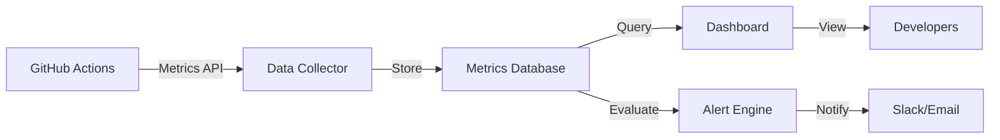

# CI/CD Monitoring and Metrics Strategy

**Status**: Proposed
**Version**: 1.0
**Last Updated**: 2025-10-04
**Owner**: Chief Architect

---

## Executive Summary

This document defines a comprehensive monitoring and metrics strategy for our optimized CI/CD pipeline, enabling data-driven optimization and early detection of performance degradation.

**Key Objectives**:
1. **Real-time visibility**: Track build duration, test execution, and failure rates
2. **Cost tracking**: Monitor CI spend and identify optimization opportunities
3. **Quality assurance**: Detect flaky tests and ensure constitutional compliance
4. **Performance optimization**: Identify bottlenecks and track improvement trends
5. **Proactive alerting**: Alert on anomalies before they impact development

---

## Table of Contents

1. [Monitoring Architecture](#monitoring-architecture)
2. [Key Metrics](#key-metrics)
3. [Dashboard Design](#dashboard-design)
4. [Alerting Strategy](#alerting-strategy)
5. [Data Collection](#data-collection)
6. [Analysis and Reporting](#analysis-and-reporting)

---

## Monitoring Architecture

### Data Flow



### Components

**1. Data Sources**:
- GitHub Actions API (workflow runs, job metrics)
- Workflow artifacts (test results, coverage)
- Custom metrics (logged to artifacts)
- GitHub billing API (cost data)

**2. Data Collector**:
- GitHub Actions workflow (`collect-metrics.yml`)
- Runs post-job completion
- Aggregates metrics from multiple sources
- Stores in structured format (JSON Lines)

**3. Storage**:
- GitHub Actions artifacts (90-day retention)
- Optional: External time-series database (InfluxDB, Prometheus)
- Cost: Free (artifacts) or ~$10/month (hosted DB)

**4. Visualization**:
- GitHub Actions summary (built-in)
- Custom dashboard (GitHub Pages + Chart.js)
- Optional: Grafana (advanced analytics)

**5. Alerting**:
- GitHub Actions workflow (threshold checks)
- Slack integration (high-priority alerts)
- Email notifications (constitutional violations)

---

## Key Metrics

### Primary Metrics (Track Always)

#### 1. Build Duration

**Definition**: Time from workflow start to completion

**Metrics**:
```yaml
build_duration:
  p50:  # Median duration (50th percentile)
    target: <2 minutes (PRs), <4 minutes (main)
    alert_threshold: >5 minutes
  p95:  # 95th percentile
    target: <5 minutes (PRs), <8 minutes (main)
    alert_threshold: >10 minutes
  p99:  # 99th percentile
    target: <8 minutes (any)
    alert_threshold: >15 minutes
```

**Collection**:
```yaml
- name: Record build duration
  run: |
    START_TIME=${{ github.event.workflow_run.created_at }}
    END_TIME=$(date -u +%Y-%m-%dT%H:%M:%SZ)
    DURATION=$(($(date -d "$END_TIME" +%s) - $(date -d "$START_TIME" +%s)))
    echo "duration_seconds=$DURATION" >> metrics.json
```

**Analysis**:
- Trend over time (detect degradation)
- Compare PR vs main branch
- Break down by test mode (critical, smart, full)
- Identify slowest builds (investigate outliers)

---

#### 2. Test Execution Time

**Definition**: Time spent running tests (excluding setup)

**Metrics**:
```yaml
test_execution:
  total_duration:
    target: <120 seconds
    alert_threshold: >300 seconds
  per_test_avg:
    target: <100ms
    alert_threshold: >200ms
  slowest_tests:
    track: top 10 slowest tests
    alert_threshold: >5 seconds per test
```

**Collection**:
```yaml
- name: Track test durations
  run: |
    pytest --durations=0 --json-report --json-report-file=test-report.json
    # Extract timing data from test-report.json
```

**Analysis**:
- Identify slow tests (candidates for optimization)
- Track test suite growth over time
- Measure impact of parallelization
- Detect test performance regressions

---

#### 3. Cache Performance

**Definition**: Hit rate and effectiveness of GitHub Actions cache

**Metrics**:
```yaml
cache_performance:
  hit_rate:
    target: >90%
    alert_threshold: <70%
  miss_rate:
    target: <10%
    alert_threshold: >30%
  size:
    target: <500MB
    alert_threshold: >1GB
  restore_time:
    target: <30 seconds
    alert_threshold: >60 seconds
```

**Collection**:
```yaml
- name: Cache hit/miss tracking
  id: cache
  uses: actions/cache@v4
  # Automatically tracked by GitHub Actions

- name: Record cache metrics
  run: |
    echo "cache_hit=${{ steps.cache.outputs.cache-hit }}" >> metrics.json
    echo "cache_key=${{ steps.cache.outputs.cache-matched-key }}" >> metrics.json
```

**Analysis**:
- Cache hit rate trends
- Identify cache invalidation causes
- Optimize cache key strategies
- Monitor cache storage costs

---

#### 4. Test Pass Rate

**Definition**: Percentage of tests passing on each build

**Metrics**:
```yaml
test_pass_rate:
  main_branch:
    target: 100%  # Constitutional requirement (Article II)
    alert_threshold: <100%  # P1 alert - constitutional violation
  pr_builds:
    target: >80%
    alert_threshold: <60%
  first_time_pass_rate:
    target: >70%
    alert_threshold: <50%
```

**Collection**:
```yaml
- name: Calculate pass rate
  run: |
    TOTAL=$(pytest --collect-only -q | tail -1 | awk '{print $1}')
    PASSED=$(pytest --tb=no -q | grep "passed" | awk '{print $1}')
    PASS_RATE=$((100 * PASSED / TOTAL))
    echo "pass_rate=$PASS_RATE" >> metrics.json
```

**Analysis**:
- Constitutional compliance tracking (Article II)
- Test stability trends
- Correlation with code changes
- Developer-specific pass rates (for coaching)

---

#### 5. Failure Rate by Type

**Definition**: Breakdown of failure causes

**Metrics**:
```yaml
failure_types:
  lint_failures:
    target: <20%
    note: "Should fail fast in Stage 1"
  type_failures:
    target: <15%
    note: "Should fail fast in Stage 1"
  unit_test_failures:
    target: <30%
    note: "Should fail in Stage 2"
  integration_test_failures:
    target: <10%
    note: "Expensive - minimize these"
  infrastructure_failures:
    target: <5%
    alert_threshold: >10%
```

**Collection**:
```yaml
- name: Categorize failure
  if: failure()
  run: |
    if [ "${{ job.name }}" == "Quick Checks" ]; then
      echo "failure_type=lint" >> metrics.json
    elif [ "${{ job.name }}" == "Critical Tests" ]; then
      echo "failure_type=unit_test" >> metrics.json
    fi
```

**Analysis**:
- Validate fail-fast effectiveness
- Identify common failure patterns
- Guide developer education
- Optimize quality gate staging

---

### Secondary Metrics (Track Periodically)

#### 6. Flaky Test Detection

**Definition**: Tests that fail intermittently

**Metrics**:
```yaml
flaky_tests:
  flaky_rate:
    target: <1%
    alert_threshold: >5%
  flaky_test_count:
    target: 0
    alert_threshold: >10 tests
  retry_success_rate:
    target: >90% (if retries enabled)
```

**Collection**:
```yaml
- name: Detect flaky tests
  run: |
    # Run tests 3 times, track inconsistent results
    python tools/ci/detect_flaky_tests.py
```

**Analysis**:
- Identify specific flaky tests
- Root cause analysis (timing, state, environment)
- Quarantine flaky tests
- Track fix effectiveness

---

#### 7. Smart Test Selection Accuracy

**Definition**: Correctness of smart test selector

**Metrics**:
```yaml
smart_selection:
  accuracy:
    target: >99%
    alert_threshold: <95%
  false_negatives:
    target: 0
    alert_threshold: >0  # P1 alert - missed failures
  test_reduction:
    target: 80% (for small PRs)
    note: "Efficiency metric"
  selection_time:
    target: <10 seconds
    alert_threshold: >30 seconds
```

**Collection**:
```yaml
- name: Validate smart selection
  run: |
    # Weekly: compare smart vs full test results
    python tools/ci/validate_smart_selection.py
```

**Analysis**:
- Weekly validation reports
- False negative investigations
- Selection algorithm tuning
- Efficiency vs safety tradeoff

---

#### 8. Cost Tracking

**Definition**: CI/CD spending over time

**Metrics**:
```yaml
cost_tracking:
  daily_spend:
    target: <$1/day
    alert_threshold: >$5/day
  monthly_spend:
    target: <$30/month
    alert_threshold: >$50/month
  cost_per_build:
    target: <$0.02
    alert_threshold: >$0.05
  cost_trend:
    target: decreasing or flat
    alert_threshold: increasing >10% month-over-month
```

**Collection**:
```yaml
- name: Calculate build cost
  run: |
    DURATION_MIN=$((DURATION / 60))
    COST=$(echo "$DURATION_MIN * 0.008" | bc)
    echo "build_cost=$COST" >> metrics.json
```

**Analysis**:
- Monthly cost reports
- Cost attribution (by team, PR, branch)
- ROI tracking (time saved vs cost)
- Budget forecasting

---

#### 9. Developer Experience

**Definition**: Developer satisfaction with CI/CD

**Metrics**:
```yaml
developer_experience:
  satisfaction_score:
    target: >4/5
    survey_frequency: quarterly
  reported_issues:
    target: <5/month
    alert_threshold: >10/month
  build_retry_rate:
    target: <5%
    alert_threshold: >15%
  context_switch_cost:
    target: <2 minutes (perceived wait)
```

**Collection**:
- Quarterly developer survey
- Issue tracker analysis
- Build retry metrics
- Qualitative feedback

**Analysis**:
- Identify pain points
- Prioritize improvements
- Track satisfaction trends
- Validate optimization impact

---

## Dashboard Design

### Primary Dashboard (GitHub Actions Summary)

**Built-in, no setup required**

**Sections**:

1. **Build Status Overview**:
   ```
   ✅ Build #123 - PASSED (2m 15s)
   ├─ Quick Checks:     ✅ 28s
   ├─ Critical Tests:   ✅ 1m 10s
   └─ Smart Tests:      ✅ 37s
   ```

2. **Test Results**:
   ```
   Tests: 1,725 total
   ✅ Passed: 1,725 (100%)
   ❌ Failed: 0
   ⏭️  Skipped: 0
   ⏱️  Duration: 1m 10s
   ```

3. **Cache Performance**:
   ```
   Dependency Cache: ✅ HIT (90s saved)
   Pytest Cache:     ✅ HIT (10s saved)
   Hypothesis Cache: ✅ HIT (5s saved)
   ```

4. **Cost Estimate**:
   ```
   Build duration: 2m 15s
   Estimated cost: $0.018
   Monthly spend (projected): $27
   ```

---

### Custom Dashboard (GitHub Pages)

**URL**: `https://[org].github.io/[repo]/ci-dashboard/`

**Technologies**:
- Static HTML/JS (hosted on GitHub Pages)
- Chart.js for visualizations
- Data source: GitHub Actions API + artifacts

**Sections**:

#### 1. Performance Trends
```javascript
// Line chart: Build duration over time
{
  labels: ['Week 1', 'Week 2', 'Week 3', 'Week 4'],
  datasets: [
    {
      label: 'PR Builds (p50)',
      data: [480, 240, 180, 120],  // seconds
      borderColor: 'blue'
    },
    {
      label: 'Main Branch (p50)',
      data: [600, 300, 240, 180],
      borderColor: 'green'
    }
  ]
}
```

#### 2. Test Execution Breakdown
```javascript
// Stacked bar chart: Time spent by stage
{
  labels: ['Week 1', 'Week 2', 'Week 3', 'Week 4'],
  datasets: [
    { label: 'Setup', data: [120, 30, 20, 15] },
    { label: 'Tests', data: [400, 180, 120, 90] },
    { label: 'Reporting', data: [20, 10, 10, 5] }
  ]
}
```

#### 3. Cache Hit Rate
```javascript
// Pie chart: Cache performance
{
  labels: ['Cache Hit', 'Cache Miss'],
  datasets: [{
    data: [92, 8],  // percentages
    backgroundColor: ['green', 'red']
  }]
}
```

#### 4. Failure Distribution
```javascript
// Bar chart: Failures by type
{
  labels: ['Lint', 'Type', 'Unit', 'Integration', 'Infra'],
  datasets: [{
    data: [35, 15, 30, 10, 10],  // percentages
    backgroundColor: 'orange'
  }]
}
```

#### 5. Cost Tracking
```javascript
// Line chart: Daily CI spend
{
  labels: ['Day 1', 'Day 2', ..., 'Day 30'],
  datasets: [{
    label: 'Daily Cost ($)',
    data: [3.20, 2.80, 0.95, ...],
    borderColor: 'purple'
  }]
}
```

---

### Advanced Dashboard (Grafana - Optional)

**Setup Cost**: $15/month (Grafana Cloud) or self-hosted

**Benefits**:
- Real-time monitoring
- Advanced alerting
- Custom queries
- Historical analysis

**Use Case**: Only if team grows >10 developers

---

## Alerting Strategy

### Alert Levels

**P1 - Critical** (immediate action required):
- Main branch test failures (Article II violation)
- Smart selection false negatives (missed bugs)
- CI infrastructure outages
- **Notification**: Slack + Email + SMS

**P2 - High** (action required within 24h):
- Build duration >10 minutes
- Flaky test rate >5%
- Cost >$5/day
- **Notification**: Slack + Email

**P3 - Medium** (action required within 1 week):
- Cache hit rate <70%
- Build duration >5 minutes (p95)
- Test suite growth >10% month-over-month
- **Notification**: Slack

**P4 - Low** (informational):
- Build duration trends
- Cost trends
- Performance improvements
- **Notification**: Dashboard only

---

### Alert Definitions

#### Alert 1: Constitutional Violation (P1)

```yaml
name: "Article II Violation - Test Failures on Main"
trigger:
  condition: test_pass_rate < 100% on main branch
  evaluation: on every main branch build
action:
  - Block merge (pre-merge hook)
  - Slack: #emergency-ci channel
  - Email: tech-leads@company.com
  - Create incident ticket
message: |
  🚨 CONSTITUTIONAL VIOLATION - Article II
  Main branch test failures detected
  Pass rate: {{ pass_rate }}%
  Build: {{ build_url }}
  Action required: Fix immediately
```

---

#### Alert 2: Build Duration Degradation (P2)

```yaml
name: "Build Duration Exceeds Threshold"
trigger:
  condition: build_duration_p95 > 10 minutes
  evaluation: daily (rolling 7-day window)
action:
  - Slack: #ci-monitoring channel
  - Email: dev-team@company.com
message: |
  ⚠️  Build duration degradation detected
  P95 duration: {{ duration_p95 }} minutes
  Target: <5 minutes
  Investigate: {{ dashboard_url }}
```

---

#### Alert 3: Cost Spike (P2)

```yaml
name: "Daily CI Cost Exceeds Budget"
trigger:
  condition: daily_spend > $5
  evaluation: daily at midnight
action:
  - Slack: #ci-monitoring channel
  - Email: engineering-manager@company.com
message: |
  💰 CI cost spike detected
  Daily spend: ${{ daily_spend }}
  Budget: $1/day
  Monthly projection: ${{ monthly_projection }}
  Review: {{ cost_dashboard_url }}
```

---

#### Alert 4: Flaky Tests (P3)

```yaml
name: "Flaky Test Rate Exceeded"
trigger:
  condition: flaky_test_rate > 5%
  evaluation: weekly
action:
  - Slack: #test-quality channel
message: |
  ⚡ Flaky test rate exceeded threshold
  Flaky tests: {{ flaky_test_count }}
  Rate: {{ flaky_test_rate }}%
  Review: {{ flaky_tests_report_url }}
  Action: Quarantine and fix
```

---

### Alert Implementation

**GitHub Actions Workflow** (`.github/workflows/alerting.yml`):

```yaml
name: CI Alerting

on:
  schedule:
    - cron: '0 * * * *'  # Hourly
  workflow_run:
    workflows: ["Optimized CI Pipeline"]
    types: [completed]

jobs:
  evaluate-alerts:
    runs-on: ubuntu-latest
    steps:
      - name: Fetch metrics
        run: |
          # Query GitHub Actions API for recent builds
          gh api repos/${{ github.repository }}/actions/runs \
            --jq '.workflow_runs[] | select(.created_at > (now - 86400))'

      - name: Evaluate thresholds
        run: |
          python tools/ci/evaluate_alerts.py metrics.json

      - name: Send alerts
        if: steps.evaluate.outputs.alerts_triggered == 'true'
        run: |
          # Send Slack notification
          curl -X POST ${{ secrets.SLACK_WEBHOOK_URL }} \
            -H 'Content-Type: application/json' \
            -d '{"text": "${{ steps.evaluate.outputs.alert_message }}"}'
```

---

## Data Collection

### Automated Collection (GitHub Actions)

**Workflow**: `.github/workflows/collect-metrics.yml`

```yaml
name: Collect CI Metrics

on:
  workflow_run:
    workflows: ["Optimized CI Pipeline", "PR Checks"]
    types: [completed]

jobs:
  collect-metrics:
    runs-on: ubuntu-latest
    steps:
      - name: Checkout code
        uses: actions/checkout@v4

      - name: Download artifacts
        uses: actions/download-artifact@v4
        with:
          name: ci-metrics

      - name: Aggregate metrics
        run: |
          python tools/ci/aggregate_metrics.py \
            --input logs/ci_metrics/ \
            --output metrics_summary.json

      - name: Upload to storage
        run: |
          # Store in GitHub artifacts (90-day retention)
          mkdir -p metrics_archive
          cp metrics_summary.json metrics_archive/metrics_$(date +%Y%m%d).json

      - name: Update dashboard data
        run: |
          # Update JSON file for GitHub Pages dashboard
          python tools/ci/update_dashboard_data.py

      - name: Commit dashboard updates
        run: |
          git config user.name "CI Metrics Bot"
          git config user.email "ci-bot@agency.com"
          git add docs/ci-dashboard/data.json
          git commit -m "Update CI metrics dashboard [skip ci]"
          git push
```

---

### Manual Collection (Developer Surveys)

**Quarterly Developer Survey** (Google Forms):

1. **How satisfied are you with CI/CD speed?** (1-5)
2. **How often do you experience CI failures?** (Never/Rarely/Sometimes/Often)
3. **How long do you typically wait for CI feedback?** (<2min / 2-5min / 5-10min / >10min)
4. **What is your biggest CI/CD pain point?** (Free text)
5. **How reliable is our CI/CD?** (1-5)

**Collection**: Quarterly via email, results logged to `docs/surveys/`

---

## Analysis and Reporting

### Daily Reports (Automated)

**Slack Message** (posted to #ci-monitoring at 9am):

```
📊 Daily CI Report - {{ date }}

✅ Build Success: 45/50 (90%)
⏱️  Avg Duration: 2m 15s (target: <3min)
💰 Cost Today: $0.95 (budget: <$1)
🎯 Cache Hit Rate: 93%

Top Issues:
1. 5 lint failures (avg 35s to fail)
2. 3 unit test failures (avg 1m 30s)
3. 2 infrastructure timeouts (10m+)

View Dashboard: https://agency.github.io/ci-dashboard
```

---

### Weekly Reports (Automated)

**Email** (sent to dev-team@company.com every Monday):

```
Subject: Weekly CI/CD Performance Report

📈 Week of {{ week }}

Performance Summary:
- Builds: 350 total (300 passed, 50 failed)
- Avg duration: 2m 18s (↓ 12s from last week)
- Cost: $6.50 (↓ $1.20 from last week)
- Cache hit rate: 91% (↑ 3% from last week)

Key Metrics:
- PR feedback time (p50): 2m 10s ✅
- Main branch time (p50): 3m 45s ✅
- Test pass rate (main): 100% ✅
- Flaky test rate: 0.8% ✅

Trends:
📉 Build duration: Decreasing (good)
📉 Cost: Decreasing (good)
📈 Cache hit rate: Improving (good)
📊 Build volume: Stable

Action Items:
- None this week - all metrics green

View Full Report: https://agency.github.io/ci-dashboard/weekly/2025-10-04
```

---

### Monthly Reports (Manual)

**Document**: `docs/ci-reports/YYYY-MM.md`

**Sections**:

1. **Executive Summary**:
   - Key achievements
   - Cost savings
   - Performance improvements

2. **Detailed Metrics**:
   - All primary metrics with trends
   - Month-over-month comparisons
   - Year-to-date progress

3. **Cost Analysis**:
   - Monthly spend breakdown
   - Cost per build
   - ROI calculation

4. **Optimization Opportunities**:
   - Identified bottlenecks
   - Proposed improvements
   - Priority ranking

5. **Action Items**:
   - Follow-up from previous month
   - New initiatives for next month

**Distribution**: Engineering leadership, posted to wiki

---

## Implementation Checklist

### Week 1: Basic Metrics
- [ ] Set up metrics collection workflow
- [ ] Create GitHub Actions summary templates
- [ ] Implement build duration tracking
- [ ] Set up basic alerting (P1 only)

### Week 2: Dashboard
- [ ] Create GitHub Pages dashboard skeleton
- [ ] Implement performance trends chart
- [ ] Add cache performance visualization
- [ ] Set up automated dashboard updates

### Week 3: Advanced Metrics
- [ ] Implement flaky test detection
- [ ] Add smart selection accuracy tracking
- [ ] Create cost tracking reports
- [ ] Expand alerting (P2, P3)

### Week 4: Reporting
- [ ] Automate daily Slack reports
- [ ] Automate weekly email reports
- [ ] Create monthly report template
- [ ] Document monitoring runbook

---

## Conclusion

This monitoring strategy provides comprehensive visibility into our CI/CD pipeline, enabling:

1. **Proactive issue detection** (before developers are impacted)
2. **Data-driven optimization** (identify bottlenecks with metrics)
3. **Cost control** (track spending, prevent overruns)
4. **Quality assurance** (constitutional compliance, flaky test detection)
5. **Continuous improvement** (trend analysis, ROI tracking)

**Next Steps**:
1. Review and approve monitoring strategy
2. Set up basic metrics collection (Week 1)
3. Create GitHub Pages dashboard (Week 2)
4. Implement full alerting (Week 3)
5. Launch reporting automation (Week 4)

---

**Document Version History**:
- v1.0 (2025-10-04): Initial monitoring strategy
