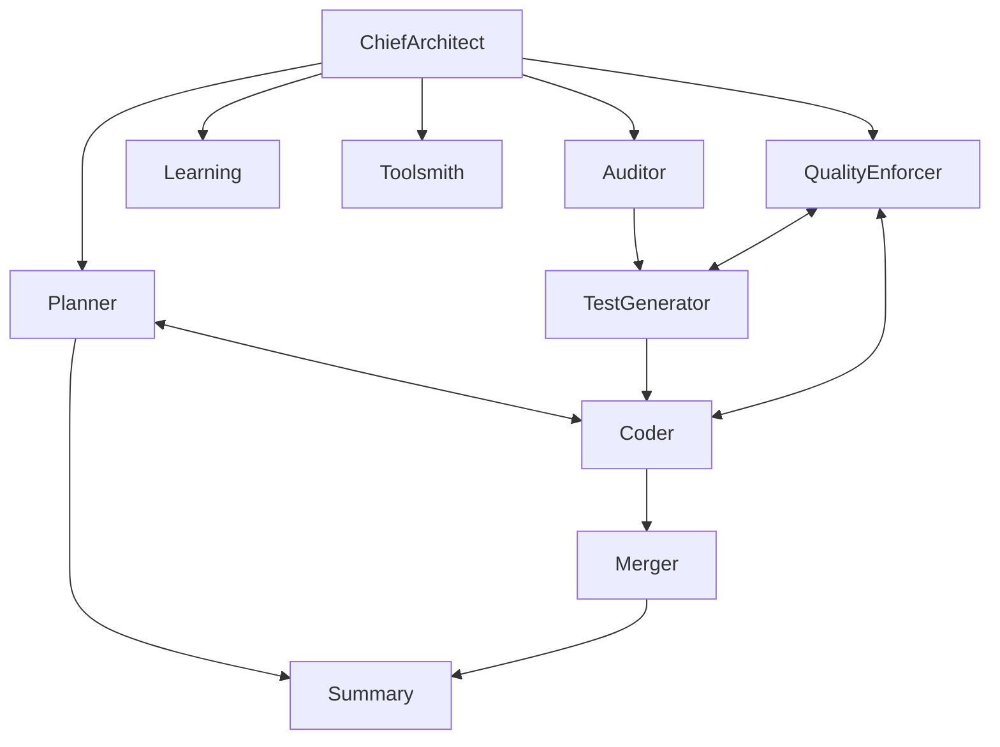

# Agency Architecture Overview

**Elite autonomous software engineering platform with constitutional governance**

## System Architecture

### High-Level Components

```
┌─────────────────────────────────────────────────────────────┐
│                     Agency Orchestrator                      │
│                      (agency.py)                            │
└─────────────────────────────────────────────────────────────┘
                              │
                              ▼
┌─────────────────────────────────────────────────────────────┐
│                    Shared Infrastructure                     │
│  ┌──────────────┐  ┌──────────────┐  ┌──────────────┐     │
│  │ AgentContext │  │  VectorStore │  │ CostTracker  │     │
│  │   (Memory)   │  │  (Learning)  │  │  (Budget)    │     │
│  └──────────────┘  └──────────────┘  └──────────────┘     │
└─────────────────────────────────────────────────────────────┘
                              │
                              ▼
┌─────────────────────────────────────────────────────────────┐
│                      10 Specialized Agents                   │
│  ┌──────────────┐  ┌──────────────┐  ┌──────────────┐     │
│  │ChiefArchitect│  │   Planner    │  │    Coder     │     │
│  └──────────────┘  └──────────────┘  └──────────────┘     │
│  ┌──────────────┐  ┌──────────────┐  ┌──────────────┐     │
│  │   Auditor    │  │TestGenerator │  │QualityEnforcer│    │
│  └──────────────┘  └──────────────┘  └──────────────┘     │
│  ┌──────────────┐  ┌──────────────┐  ┌──────────────┐     │
│  │  Learning    │  │    Merger    │  │  Toolsmith   │     │
│  └──────────────┘  └──────────────┘  └──────────────┘     │
│  ┌──────────────┐                                          │
│  │   Summary    │                                          │
│  └──────────────┘                                          │
└─────────────────────────────────────────────────────────────┘
                              │
                              ▼
┌─────────────────────────────────────────────────────────────┐
│                        45 Production Tools                   │
│  File Ops │ Git │ Quality │ Code Gen │ Orchestration       │
└─────────────────────────────────────────────────────────────┘
```

## Core Principles

### Constitutional Governance
**5 Unbreakable Articles**:
1. **Complete Context** - No action without full understanding
2. **100% Verification** - All tests must pass (no exceptions)
3. **Automated Enforcement** - Quality gates are absolute
4. **Continuous Learning** - VectorStore integration mandatory
5. **Spec-Driven Development** - Complex features require formal specs

### Design Philosophy
- **LLM-First**: Delegate complex analysis to GPT-5 intelligence
- **Type Safety**: Zero `Dict[Any, Any]`, always Pydantic models
- **Result Pattern**: Explicit error handling via `Result<T, E>`
- **TDD Mandatory**: Tests written BEFORE implementation
- **Function Size**: <50 lines per function (constitutional law)

## Agent Orchestration

### Communication Flows



### Agent Tiers

**Tier 1: Strategic (GPT-5 + High Reasoning)**
- ChiefArchitect - Strategic oversight, ADR creation
- Planner - Spec-kit methodology, o3-capable
- Auditor - NECESSARY pattern analysis
- LearningAgent - Pattern extraction, VectorStore
- QualityEnforcer - Constitutional compliance

**Tier 2: Execution (GPT-5 + Medium Reasoning)**
- AgencyCodeAgent - Primary development, TDD-first
- TestGenerator - AAA pattern, NECESSARY compliance
- Merger - Git workflow automation
- Toolsmith - Tool development

**Tier 3: Support (GPT-5-mini for efficiency)**
- WorkCompletionSummary - Task summaries

## Memory & Learning Architecture

### VectorStore Integration (Article IV Mandatory)

```
Session Transcripts (logs/sessions/)
        ↓
Learning Agent Analysis
        ↓
Pattern Extraction (confidence ≥ 0.6, evidence ≥ 3)
        ↓
VectorStore Embeddings (sentence-transformers)
        ↓
Cross-Session Pattern Recognition
        ↓
Agent Query Before Decisions
```

### Memory API

```python
# Store memory
context.store_memory(
    key="pattern_name",
    content="description",
    tags=["agent", "success"]
)

# Search memories
results = context.search_memories(
    tags=["pattern"],
    include_session=True
)
```

## Autonomous Healing System

### Self-Healing Workflow

```
Error Detection → QualityEnforcer → LLM Analysis (GPT-5)
      ↓                                    ↓
Telemetry Log                     Fix Generation
      ↓                                    ↓
Learning Store ←─ Success ← Test Verify → Apply/Rollback
```

### Healing Capabilities
- **NoneType Auto-Fix**: Automatic detection and intelligent fixes
- **Patch Application**: Safe application with rollback
- **Test Verification**: Full suite validation before commit
- **Audit Trails**: Complete history in `logs/autonomous_healing/`

## Trinity Protocol Integration

**Production multi-agent coordination system**:
- **59% code reduction** (8,063 lines from 19,734)
- **100% test coverage** for core
- **Reusable components**: MessageBus, CostTracker, HITL protocol

**Location**: `trinity_protocol/`
- `core/` - Production code
- `experimental/` - Prototypes (voice transcription, ambient listening)
- `demos/` - Working examples

## Testing Infrastructure

### Test Organization
```
tests/
├─ unit/              # Core functionality
├─ integration/       # Agent communication
├─ e2e/              # Complete workflows
├─ benchmarks/       # Performance validation
└─ trinity_protocol/ # Trinity-specific tests
```

### Metrics
- **1,568+ tests** with 100% pass rate
- **139 test files** across codebase
- **Complete coverage** for autonomous healing
- **Constitutional compliance** tests

## Tool Infrastructure

### 45 Production Tools

**Categories**:
- **File Operations** (7): read, write, edit, multi_edit, glob, grep, ls
- **Git Workflow** (4): git, git_workflow, git_workflow_tool, git_unified
- **Code Quality** (5): constitution_check, analyze_type_patterns, no_dict_any_check, auto_fix_nonetype, apply_and_verify_patch
- **Execution** (5): bash, todo_write, telemetry, dashboard, tail
- **Code Generation** (3): scaffold, test_gen, analyzer
- **Orchestration** (3): api, scheduler, graph
- **Kanban** (4): server, adapters, hints, untracked
- **Context** (4): handoff, handoff_read, exit_plan_mode, undo_snapshot
- **Advanced** (10): learning_dashboard, document_generator, spec_traceability, feature_inventory, anthropic_agent, web_search, notebook_read, notebook_edit, etc.

### Tool Patterns
- **Result<T, E>** for error handling
- **Constitutional timeout wrapper** for Article I compliance
- **Telemetry integration** for learning
- **Type-safe parameters** (Pydantic models)

## Configuration

### Model Policy

```python
# Per-agent model selection with env overrides
PLANNER_MODEL=gpt-5          # Strategic planning
CODER_MODEL=gpt-5            # Development
AUDITOR_MODEL=gpt-5          # Quality analysis
QUALITY_ENFORCER_MODEL=gpt-5 # Constitutional compliance
SUMMARY_MODEL=gpt-5-mini     # Cost-efficient summaries
```

### Memory Configuration

```bash
# Article IV Mandatory
USE_ENHANCED_MEMORY=true     # VectorStore integration
FRESH_USE_FIRESTORE=false    # Optional Firestore backend
```

## Performance Metrics

### System Benchmarks
- **Test Execution**: 185 seconds for 1,568 tests
- **Parallel Processing**: 10 workers
- **Memory Efficiency**: Optimized context management
- **API Timeouts**: 30-second limits on external calls

### Quality Metrics
- **Type Safety**: 100% mypy compliance
- **Test Coverage**: 1,568+ tests (100% pass rate)
- **Constitutional Compliance**: Zero violations permitted
- **Healing Success Rate**: >95% autonomous resolution

## Scalability

### Current Capacity
- **Agents**: 10 production agents
- **Tools**: 45 production tools
- **Tests**: 1,568+ automated tests
- **Codebase**: 3.7GB, 405 Python files

### Future Scaling
- **Frontend Preparation**: Ready for `/frontend/` and `/backend/` split
- **Agent Categories**: Core, specialized, experimental
- **Test Organization**: Unit, integration, e2e separation

## Security & Privacy

### Security Measures
- **Secrets Management**: .gitignore for sensitive files
- **Constitutional Enforcement**: No bypass mechanisms
- **Audit Trails**: Complete logging of all operations
- **Type Safety**: Prevents entire classes of bugs

### Privacy (Trinity Experimental)
- **Local Processing**: Whisper AI transcription on-device
- **Memory-Only**: Audio never written to disk (goal)
- **Instant Mute**: <100ms response time

---

## Further Reading

- **Agent Details**: `docs/architecture/agents.md`
- **Memory System**: `docs/architecture/memory-learning.md`
- **ADRs**: `docs/adr/ADR-INDEX.md`
- **Tools**: `.claude/quick-ref/tool-index.md`

**Version**: 0.9.5
**Last Updated**: 2025-10-03
