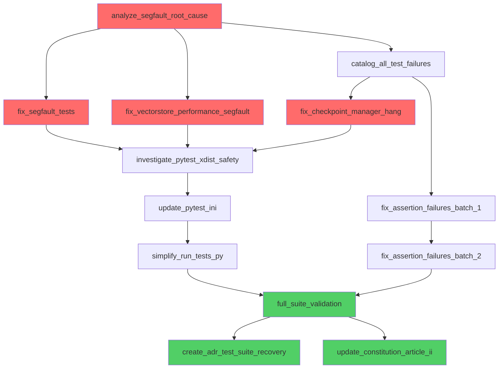

# Test Suite Recovery Mission: Autonomous Plan

## Executive Summary

**Mission**: Achieve 100% green test suite to re-enable autonomous development  
**Constitutional Significance**: Article II compliance - "100% Verification and Stability"  
**Estimated Effort**: ~65,000 tokens (~$2.50 USD)  
**Success Criteria**: All tests pass, no segfaults, no hangs, stable configuration  

## Root Causes Identified

1. **Segfault at socket.py:295**: pytest-rerunfailures plugin + Python 3.13 + async tests
2. **Double Test Execution**: run_tests.py runs pytest twice (xdist + sequential)
3. **Vectorstore Performance Segfault**: PyTorch memory issue (not xdist-related)
4. **Checkpoint Manager Hang**: Deadlock or infinite loop at test 9/20
5. **~78 Assertion Failures**: Mix of bugs, outdated tests, broken features

## Execution Plan (5 Phases, 16 Tasks)

### Phase 1: Diagnostic Analysis (3 tasks)
```
analyze_segfault_root_cause
├── catalog_all_test_failures
└── identify_run_tests_double_execution
```

**Deliverables**:
- Root cause analysis document
- Complete test failure inventory
- run_tests.py bug fix

### Phase 2: Critical Blocker Fixes (3 tasks)
```
fix_segfault_tests
├── fix_vectorstore_performance_segfault
└── fix_checkpoint_manager_hang
```

**Deliverables**:
- No more segfaults
- All tests complete without hanging
- Quarantined tests documented

### Phase 3: Assertion Failure Fixes (2 tasks)
```
fix_assertion_failures_batch_1 (first 20)
└── fix_assertion_failures_batch_2 (remaining ~58)
```

**Deliverables**:
- All assertion failures fixed or documented
- Known issues tracked with skip markers
- Test suite shows PASSED/SKIPPED only

### Phase 4: Pytest Configuration Optimization (3 tasks)
```
investigate_pytest_xdist_safety
├── update_pytest_ini
└── simplify_run_tests_py
```

**Deliverables**:
- Safe pytest-xdist configuration
- Optimized pytest.ini
- Simplified run_tests.py

### Phase 5: Verification and Documentation (3 tasks)
```
full_suite_validation
├── create_adr_test_suite_recovery
└── update_constitution_article_ii
```

**Deliverables**:
- 100% green test suite (3 consecutive runs)
- ADR-030 documenting recovery
- Updated constitution with new testing practices

## Task Graph (Mermaid)



## Execution Strategy

### Parallelization Opportunities
- **Layer 1**: analyze_segfault_root_cause, identify_run_tests_double_execution (parallel)
- **Layer 2**: catalog_all_test_failures (after analysis)
- **Layer 3**: fix_segfault_tests, fix_vectorstore_performance_segfault, fix_checkpoint_manager_hang (parallel)
- **Layer 4**: fix_assertion_failures_batch_1 (after catalog)
- **Layer 5**: investigate_pytest_xdist_safety (after all blockers fixed)
- **Layer 6**: fix_assertion_failures_batch_2, update_pytest_ini (parallel)
- **Layer 7**: simplify_run_tests_py (after pytest.ini updated)
- **Layer 8**: full_suite_validation (after all fixes)
- **Layer 9**: create_adr_test_suite_recovery, update_constitution_article_ii (parallel)

### Checkpoints
1. **After Phase 1**: Validate root causes identified
2. **After Phase 2**: Validate all segfaults/hangs eliminated
3. **After Phase 4**: Validate pytest configuration stable

## Constitutional Compliance

**Article I**: Complete context before action
- ✅ Full diagnostic analysis before fixes
- ✅ Catalog all failures, not just first encountered

**Article II**: 100% verification and stability
- ✅ Goal: 100% green test suite
- ✅ 3 consecutive runs to verify stability
- ✅ No broken windows accepted

**Article III**: Automated enforcement
- ✅ Pre-commit hooks will enforce test pass requirement
- ✅ Quality gates mandatory

**Article IV**: Continuous learning
- ✅ ADR documents root causes and fixes
- ✅ Patterns stored in VectorStore
- ✅ Prevention strategies defined

**Article V**: Spec-driven development
- ✅ This mission plan IS the specification
- ✅ Task graph traceable to requirements

## Success Metrics

| Metric | Current | Target |
|--------|---------|--------|
| Test Pass Rate | ~0% (segfault/hang) | 100% |
| Segfaults | Yes | 0 |
| Hangs | Yes | 0 |
| Assertion Failures | ~78 | 0 |
| Execution Time | Timeout (1h+) | <10 minutes |
| Worker Count | 0 (disabled xdist) | 4-10 (optimized) |

## Risk Mitigation

**High Risk**: Python 3.13 incompatibility
- **Mitigation**: Pin Python 3.12 if unfixable, document in ADR

**Medium Risk**: Unfixable tests (broken features)
- **Mitigation**: Quarantine with @pytest.mark.skip, track in backlog

**Low Risk**: Flaky tests after parallelism restored
- **Mitigation**: Add @pytest.mark.serial, adjust worker count

## Next Steps

Run this mission with:
```bash
/primeA --graph missions/test_suite_recovery_mission.json --visualize
```

Or execute autonomously:
```bash
/primeA --graph missions/test_suite_recovery_mission.json --auto-pr
```

---

**This plan will invariably lead to a clean and green main branch with a working test suite.**
