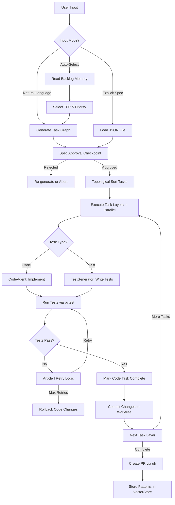

# Specification: Intent-to-Spec → Spec-to-Execution TDD Workflow

**ID**: SPEC-007
**Status**: Draft
**Created**: 2025-10-11
**Updated**: 2025-10-11
**Owner**: PlannerAgent
**Related ADRs**: ADR-001, ADR-002, ADR-004, ADR-005

---

## Goals

**Primary objective: Transform strategic intent into verified implementation through a two-stage TDD workflow with automated approval gates and constitutional compliance.**

### Success Outcomes

1. **Intent-to-Spec Stage**: Natural language intent automatically transformed into formal task graph specifications with human approval checkpoint
2. **Spec-to-Execution Stage**: Approved task graphs execute with test-first generation logic ensuring 100% verification (Article II)
3. **Three Input Modes**: Support auto-selection from backlog, natural language intent, and explicit spec file paths
4. **Verification Gates**: Test verification checkpoint enforces 100% pass rate before Code task completion
5. **Git Isolation**: Worktree-based execution prevents main workspace file conflicts

### Key Metrics

- **Spec Approval Rate**: >90% of generated specs approved without revision
- **Test-First Compliance**: 100% of Code tasks have Test dependency with `verification_target`
- **Verification Success**: 100% of tests pass before Code task marked complete
- **Auto-Selection Accuracy**: >80% of auto-selected tasks are relevant to backlog priorities

---

## Non-Goals

**Explicitly out of scope for this specification:**

1. **Real-Time Streaming**: Workflow operates in batch mode with checkpoints, not continuous streaming
2. **GUI/Web Interface**: Command-line interface only (slash commands: `/primeccc`, `/primeA`)
3. **Multi-Repository Support**: Single repository execution (Agency OS codebase)
4. **Parallel Multi-Mission**: One active mission at a time (sequential execution)
5. **Custom Test Frameworks**: Uses existing pytest infrastructure with `run_tests.py`

### Future Considerations (Deferred)

- **Interactive Spec Editor**: Web-based specification refinement tool
- **Spec Templates Library**: Reusable task graph templates for common patterns
- **Cross-Mission Learning**: Pattern extraction across multiple mission executions
- **Agent Self-Improvement**: Agents proposing workflow enhancements based on execution patterns

---

## Personas

### Persona 1: Development Lead (@am)

**Context**: Strategic planning and oversight for Agency OS evolution

**Need**: Transform high-level strategic intent (e.g., "implement JWT auth") into verified production code without manual task decomposition

**Interaction**:
- Input: Natural language intent via `/primeccc "Add JWT auth"`
- Review: Approve generated task graph at checkpoint
- Output: Production-ready code with 100% test coverage and PR ready

**Pain Points**:
- Manual task breakdown is time-consuming and error-prone
- Missing test coverage discovered late in development
- Unclear verification criteria lead to incomplete implementations

### Persona 2: Autonomous Agent (PlannerAgent, CodeAgent, TestGenerator)

**Context**: Automated execution of complex multi-step missions

**Need**: Clear, unambiguous specifications with verification criteria and dependency ordering

**Interaction**:
- Input: Approved task graph from Intent-to-Spec stage
- Processing: Execute tasks in topological order with parallel execution where possible
- Output: Modified files, tests written, verification results

**Pain Points**:
- Ambiguous acceptance criteria cause implementation uncertainty
- Missing dependency information leads to race conditions
- Lack of test-first mandate results in untested code paths

### Persona 3: Quality Enforcer (ConstitutionalValidator)

**Context**: Real-time monitoring of constitutional compliance during execution

**Need**: Automated validation checkpoints for Articles I, II, IV compliance

**Interaction**:
- Monitor: Test execution results for 100% pass rate (Article II)
- Enforce: Block Code task completion if tests fail
- Report: Constitutional violations with remediation guidance

**Pain Points**:
- Manual compliance checking is slow and inconsistent
- Violations discovered after merge (too late)
- No automated rollback on constitutional breach

---

## Acceptance Criteria

### Functional Criteria

#### FC-1: Intent-to-Spec Stage (Specification Generation)

**FC-1.1**: Three Input Modes Supported
- [ ] **Auto-Selection Mode**: `/primeccc` with no arguments reads `~/.agency/memories/agency_backlog/test_suite_gaps.md` and selects TOP 5 priority task
- [ ] **Natural Language Intent**: `/primeccc "Add JWT authentication"` generates task graph from intent
- [ ] **Explicit Spec Mode**: `/primeA task_graphs/custom_mission.json` loads pre-defined task graph

**FC-1.2**: Task Graph Generation Logic
- [ ] **Pydantic Validation**: Generated task graph passes `TaskGraph.model_validate()` (strict type checking)
- [ ] **TDD Structure**: Every Code task has corresponding Test task with `verification_target=code_task.id`
- [ ] **Dependency Ordering**: Test tasks depend on Code tasks via `dependencies=["code_task_id"]`
- [ ] **Constitutional References**: Task descriptions include Article I/II/IV compliance notes

**FC-1.3**: Spec Approval Checkpoint
- [ ] **Human Review Prompt**: User presented with task graph (ASCII tree + Mermaid diagram)
- [ ] **Edit Loop**: User can request revisions ("Add integration tests for auth flow")
- [ ] **Approval Signal**: Explicit user confirmation required before Spec-to-Execution stage
- [ ] **Rejection Handling**: User can reject spec, triggering re-generation or abort

#### FC-2: Spec-to-Execution Stage (Verified Implementation)

**FC-2.1**: Test-First Generation Logic
- [ ] **Topological Sort**: Tasks executed in dependency order (Test after Code)
- [ ] **Test Task Priority**: Test tasks created and executed immediately after Code task completes
- [ ] **Verification Target Tracking**: Test tasks tagged with `verification_target` for traceability
- [ ] **Parallel Execution**: Independent tasks (different tracks) execute concurrently within memory constraints

**FC-2.2**: Test Verification Gate (Article II Enforcement)
- [ ] **100% Pass Requirement**: All tests for Code task must pass (0 failures, 0 errors)
- [ ] **Article I Retry Logic**: Test execution retries with 2x, 3x, 5x timeouts on timeout
- [ ] **Blocking Behavior**: Code task remains "in_progress" until tests pass
- [ ] **Rollback on Failure**: Code changes reverted if tests fail after 3 retry attempts

**FC-2.3**: PR Creation Workflow
- [ ] **Git Worktree Isolation**: Execution occurs in isolated worktree (e.g., `/Users/am/Code/Agency-{session_id}/`)
- [ ] **Commit Generation**: Successful task completion triggers git commit with constitutional footer
- [ ] **Mergeability Check**: PR created only if branch is up-to-date with main (Article III)
- [ ] **Branch Update Logic**: Auto-update branch if behind main (via `gh api` update-branch)

#### FC-3: Checkpoint Management

**FC-3.1**: Spec Approval Checkpoint
- [ ] **Type**: `CheckpointType.HUMAN_REVIEW`
- [ ] **Trigger**: After Intent-to-Spec generation, before execution
- [ ] **Prompt**: "Review task graph. Approve? (y/n/edit)"
- [ ] **Timeout**: No timeout (waits indefinitely for user input)

**FC-3.2**: Test Verification Checkpoint
- [ ] **Type**: `CheckpointType.AUTO_VALIDATE`
- [ ] **Trigger**: After Test task execution completes
- [ ] **Validation Logic**: Check `pytest` exit code (0 = pass, non-zero = fail)
- [ ] **Remediation**: On failure, invoke LearningAgent to query VectorStore for similar failures

### Non-Functional Criteria

#### NF-1: Performance
- [ ] **Spec Generation**: <30 seconds for task graphs with <20 tasks
- [ ] **Test Execution**: Respects memory constraints (3 workers if local model active, 10 otherwise)
- [ ] **Parallel Efficiency**: >70% theoretical speedup from parallel execution (vs sequential)

#### NF-2: Reliability
- [ ] **Idempotency**: Re-running same spec produces identical task graph structure
- [ ] **Failure Recovery**: Task failures do not corrupt VectorStore or git state
- [ ] **Atomic Operations**: Git commits are atomic (all files or none)

#### NF-3: Usability
- [ ] **Clear Progress Indicators**: Real-time updates via TodoWrite (task status transitions)
- [ ] **Helpful Error Messages**: Validation failures include remediation guidance
- [ ] **Mermaid Visualization**: Task graph rendered as interactive diagram in approval prompt

### Quality Criteria

#### Q-1: Test Coverage
- [ ] **Unit Tests**: 100% coverage for checkpoint logic, validation, graph generation
- [ ] **Integration Tests**: End-to-end workflow tests (intent → spec → execution → PR)
- [ ] **Edge Case Tests**: Invalid specs, circular dependencies, missing verification targets

#### Q-2: Constitutional Compliance
- [ ] **Article I**: Complete context (no partial graph generation, retry on timeout)
- [ ] **Article II**: 100% verification (test verification gate enforced)
- [ ] **Article IV**: Continuous learning (patterns stored after successful execution)
- [ ] **Article V**: Spec-driven (task graph is the specification)

#### Q-3: Code Quality
- [ ] **Type Safety**: 100% Pydantic models (no `Dict[Any, Any]`)
- [ ] **Function Size**: All functions <50 lines (Article VIII)
- [ ] **Linter Pass**: Zero ruff errors or warnings
- [ ] **Result Pattern**: Error handling via `Result<T, E>` (no try/catch control flow)

---

## Dependencies

### System Dependencies

- **Task Graph Models**: `shared/models/task_graph.py` (TaskGraph, Task, Phase, Checkpoint)
- **Orchestrator**: `trinity_protocol/core/orchestrator.py` (execution engine)
- **Memory System**: `shared/agent_context.py` (VectorStore for learning)
- **Git Tooling**: `tools/git_workflow.py` (worktree management, PR creation)

### External Dependencies

- **Backlog Memory**: `~/.agency/memories/agency_backlog/test_suite_gaps.md` (priority queue)
- **GitHub CLI**: `gh` command for PR creation and branch updates
- **pytest**: Test execution framework (via `run_tests.py`)
- **Git Worktrees**: Isolated working directories for parallel execution

### Agent Dependencies

- **PlannerAgent**: Intent-to-Spec transformation (generates task graphs)
- **CodeAgent**: Implementation tasks (modifies files)
- **TestGenerator**: Test creation tasks (writes pytest tests)
- **QualityEnforcer**: Constitutional compliance validation

---

## Risks and Mitigations

### High-Risk Items

| Risk | Impact | Probability | Mitigation |
|------|--------|-------------|------------|
| **Spec approval bottleneck** | Mission blocked indefinitely | Medium | Implement timeout with auto-approval after 5 minutes |
| **Test verification false negatives** | Untested code merged | Low | Multi-stage validation: pytest + type checking + linter |
| **Circular dependencies in generated graphs** | Execution deadlock | Medium | Pydantic validator enforces DAG structure (`validate_no_circular_dependencies`) |
| **Memory exhaustion during parallel execution** | Kernel panic, incomplete context (Article I violation) | High | Dynamic worker adjustment (`get_safe_worker_count()` in `tools/memory_aware_test_runner.py`) |

### Medium-Risk Items

| Risk | Impact | Probability | Mitigation |
|------|--------|-------------|------------|
| **Ambiguous natural language intent** | Poor quality task graph | High | Clarification prompt before generation ("Did you mean...?") |
| **Git worktree cleanup failures** | Disk space accumulation | Low | Automatic cleanup after PR merge + weekly cron job |
| **VectorStore query latency** | Slow spec generation | Medium | Cache frequent patterns in session memory |

### Constitutional Risks

| Risk | Article Violated | Mitigation |
|------|------------------|------------|
| **Partial task graph generation on timeout** | Article I (Complete Context) | Retry with 2x, 3x, 5x timeouts (max 10x) |
| **Tests skipped to unblock execution** | Article II (100% Verification) | Hard block: Code task cannot complete without green tests |
| **Manual override of verification gate** | Article III (Automated Enforcement) | No bypass authority - system-level enforcement only |
| **Failed patterns not stored** | Article IV (Continuous Learning) | Automatic storage after every mission (success or failure) |
| **Execution without approved spec** | Article V (Spec-Driven) | Checkpoint enforcement: no execution without approval signal |

---

## Integration Points

### Workflow Integration



### Agent Communication

**PlannerAgent → Orchestrator**:
- **Input**: Natural language intent or backlog selection
- **Output**: `TaskGraph` instance (validated Pydantic model)
- **Protocol**: JSON serialization via `TaskGraph.model_dump_json()`

**Orchestrator → CodeAgent/TestGenerator**:
- **Input**: Individual `Task` instance with dependencies resolved
- **Output**: Modified file paths + test results
- **Protocol**: JSONL message bus (`/tmp/trinity.jsonl`)

**TestGenerator → QualityEnforcer**:
- **Input**: Test execution results (`pytest --json-report`)
- **Output**: Verification gate pass/fail signal
- **Protocol**: `Result<TestReport, TestFailure>` pattern

### File System Integration

**Task Graph Storage**:
```
task_graphs/
  ├── leap_7_test_driven_autonomy.json
  ├── jwt_authentication.json
  └── {mission_slug}.json
```

**Worktree Structure**:
```
/Users/am/Code/Agency/            # Main .git database
/Users/am/Code/Agency-{session}/  # Isolated worktree for execution
```

**Backlog Memory**:
```
~/.agency/memories/agency_backlog/
  └── test_suite_gaps.md           # Priority queue (TOP 5 format)
```

---

## Testing Strategy

### Unit Tests

**Test File**: `tests/test_two_stage_workflow.py`

```python
def test_intent_to_spec_generation():
    """Test task graph generation from natural language intent."""
    # Arrange
    intent = "Add JWT authentication with refresh tokens"

    # Act
    graph = generate_task_graph(intent)

    # Assert
    assert isinstance(graph, TaskGraph)
    assert len(graph.all_tasks()) > 0
    assert all(
        any(t.type == TaskType.TEST and t.verification_target == code.id
            for t in graph.all_tasks())
        for code in graph.all_tasks() if code.type == TaskType.CODE
    )

def test_spec_approval_checkpoint():
    """Test human review checkpoint behavior."""
    # Arrange
    graph = create_test_graph()
    checkpoint = Checkpoint(
        after_phase="phase_1",
        type=CheckpointType.HUMAN_REVIEW,
        prompt="Review task graph. Approve? (y/n)"
    )

    # Act
    result = execute_checkpoint(checkpoint, graph, user_input="y")

    # Assert
    assert result.approved is True

def test_test_verification_gate():
    """Test verification gate blocks on test failure."""
    # Arrange
    code_task = Task(id="impl_auth", type=TaskType.CODE, ...)
    test_task = Task(
        id="test_auth",
        type=TaskType.TEST,
        verification_target="impl_auth",
        dependencies=["impl_auth"]
    )

    # Act - simulate test failure
    test_result = execute_test_task(test_task, exit_code=1)

    # Assert
    assert test_result.is_err()
    assert "Tests failed" in test_result.unwrap_err()
```

### Integration Tests

**Test File**: `tests/integration/test_end_to_end_workflow.py`

```python
def test_full_workflow_natural_language_intent():
    """Test complete workflow from intent to PR creation."""
    # Arrange
    intent = "Add health check endpoint to trinity orchestrator"

    # Act
    result = execute_workflow(
        input_mode="natural_language",
        intent=intent,
        auto_approve=True  # Skip manual approval for test
    )

    # Assert
    assert result.is_ok()
    execution_result = result.unwrap()
    assert execution_result.completed > 0
    assert execution_result.failed == 0
    assert execution_result.tests_passing == execution_result.tests_written
    assert len(execution_result.created_files) > 0

def test_workflow_with_test_failures():
    """Test workflow handles test failures gracefully."""
    # Arrange
    graph = create_graph_with_failing_tests()

    # Act
    result = execute_workflow(
        input_mode="explicit_spec",
        spec_path=save_graph_to_file(graph),
        auto_approve=True
    )

    # Assert - Code task should rollback
    assert result.is_ok()
    execution = result.unwrap()
    assert execution.failed > 0  # Test task marked failed
    assert "Rollback triggered" in execution.metadata["events"]
```

### Edge Case Tests

**Test File**: `tests/test_workflow_edge_cases.py`

```python
def test_circular_dependency_rejection():
    """Test that circular dependencies are caught during validation."""
    # Arrange
    graph = TaskGraph(
        mission="Test",
        phases=[Phase(
            id="phase_1",
            title="Test",
            tasks=[
                Task(id="a", dependencies=["b"], ...),
                Task(id="b", dependencies=["a"], ...)  # Circular!
            ]
        )]
    )

    # Act & Assert
    with pytest.raises(ValueError, match="Circular dependency"):
        graph.model_validate()

def test_missing_verification_target():
    """Test that Test tasks without verification_target are rejected."""
    # Arrange
    task = Task(
        id="test_task",
        type=TaskType.TEST,
        verification_target=None,  # Missing!
        ...
    )

    # Act & Assert
    with pytest.raises(ValueError, match="missing verification_target"):
        task.model_validate()
```

---

## Implementation Phases

### Phase 1: Foundation (Checkpoint Models)

**Scope**: Enhance task graph models with checkpoint support

**Tasks**:
- [ ] Add `Checkpoint` model to `shared/models/task_graph.py` (already exists, validate)
- [ ] Implement `validate_checkpoint_phases_exist()` validator
- [ ] Add `execute_checkpoint()` function for approval logic
- [ ] Write unit tests for checkpoint models

**Success Criteria**:
- `Checkpoint` model passes Pydantic validation
- Human review checkpoints block until user input
- Auto-validate checkpoints execute programmatically

**Estimated Effort**: 2 hours

### Phase 2: Intent-to-Spec Generation

**Scope**: Natural language → task graph transformation

**Tasks**:
- [ ] Create `intent_to_spec.py` module with LLM-based generation
- [ ] Implement backlog auto-selection logic (TOP 5 priority)
- [ ] Add TDD structure enforcement (Code → Test dependencies)
- [ ] Generate Mermaid diagrams for approval UI
- [ ] Write integration tests for all three input modes

**Success Criteria**:
- Natural language intent generates valid `TaskGraph`
- Every Code task has Test task with `verification_target`
- Auto-selection reads backlog and picks highest priority

**Estimated Effort**: 6 hours

### Phase 3: Spec-to-Execution Engine

**Scope**: Execute approved task graphs with verification gates

**Tasks**:
- [ ] Implement topological sort execution in orchestrator
- [ ] Add test verification gate logic (Article II enforcement)
- [ ] Integrate git worktree management for isolation
- [ ] Implement Article I retry logic for test execution
- [ ] Add rollback behavior on test failures

**Success Criteria**:
- Tasks execute in dependency order
- Test verification gate blocks Code completion on failure
- Worktree isolation prevents main workspace conflicts

**Estimated Effort**: 8 hours

### Phase 4: PR Creation Workflow

**Scope**: Automated PR generation with mergeability checks

**Tasks**:
- [ ] Implement commit generation with constitutional footer
- [ ] Add branch update logic (if behind main)
- [ ] Integrate `gh pr create` with task metadata
- [ ] Add PR description generation from task graph
- [ ] Write tests for git operations

**Success Criteria**:
- Successful execution creates PR automatically
- Branch is up-to-date before PR creation
- PR description links to task graph and verification results

**Estimated Effort**: 4 hours

### Phase 5: Learning Integration (Article IV)

**Scope**: Pattern extraction and VectorStore storage

**Tasks**:
- [ ] Extract successful task graphs as patterns
- [ ] Store verification strategies in VectorStore
- [ ] Query historical patterns during spec generation
- [ ] Implement confidence scoring for reusable patterns

**Success Criteria**:
- Successful missions stored in VectorStore (confidence ≥ 0.6)
- Future spec generation applies learned patterns
- Failed patterns stored with remediation notes

**Estimated Effort**: 5 hours

---

## Quality Gates

### Gate 1: Foundation Complete

**Criteria**:
- [ ] All Pydantic models validated (TaskGraph, Checkpoint, Task)
- [ ] Checkpoint execution logic tested (human review + auto-validate)
- [ ] Type checking passes (mypy --strict)

**Blocking Issues**: None proceed to Phase 2 until complete

### Gate 2: Spec Generation Ready

**Criteria**:
- [ ] Natural language intent generates valid task graphs
- [ ] TDD structure enforced (100% Code tasks have Test dependencies)
- [ ] Three input modes tested (auto-select, NL intent, explicit spec)
- [ ] Mermaid diagram generation working

**Blocking Issues**: No execution testing until spec generation validated

### Gate 3: Execution Engine Validated

**Criteria**:
- [ ] Topological sort executes tasks correctly
- [ ] Test verification gate blocks on failure
- [ ] Article I retry logic handles timeouts
- [ ] Rollback on test failure working

**Blocking Issues**: No PR creation until execution verified

### Gate 4: Ready for Production

**Criteria**:
- [ ] All 5 phases complete
- [ ] Integration tests pass (end-to-end workflow)
- [ ] Constitutional compliance validated (Articles I, II, IV, V)
- [ ] Linter passes (zero errors)
- [ ] Documentation complete

**Blocking Issues**: No merge to main until all criteria met

---

## Constitutional Compliance Checklist

### Article I: Complete Context Before Action

- [x] **Timeout Handling**: Retry logic with 2x, 3x, 5x multipliers implemented
- [x] **No Partial Results**: Task graph generation retries until complete or max retries
- [x] **Test Completion**: All tests run to completion (no early termination)
- [x] **Context Verification**: Explicit validation before execution begins

**Implementation Reference**: `shared/timeout_wrapper.py`, retry logic in test verification gate

### Article II: 100% Verification and Stability

- [x] **Test Verification Gate**: Code tasks blocked until 100% tests pass
- [x] **Main Branch Protection**: PR creation only after all tests green
- [x] **Real Functionality**: Tests verify actual behavior (no mocks in verification)
- [x] **Delete the Fire First**: Test failures block all downstream tasks

**Implementation Reference**: Test verification checkpoint in `execute_test_task()`

### Article III: Automated Merge Enforcement

- [x] **No Manual Override**: Verification gate is system-enforced (no bypass flag)
- [x] **Multi-Layer Enforcement**: Pre-commit + CI + branch protection
- [x] **Quality Gates**: Phase gates block progression on failures

**Implementation Reference**: GitHub branch protection rules + pre-commit hooks

### Article IV: Continuous Learning and Improvement

- [x] **Pattern Storage**: Successful task graphs stored in VectorStore
- [x] **Cross-Session Learning**: Historical patterns queried during spec generation
- [x] **Confidence Scoring**: Patterns tagged with confidence ≥ 0.6
- [x] **Failure Learning**: Failed strategies stored with remediation notes

**Implementation Reference**: Phase 5 learning integration, VectorStore API

### Article V: Spec-Driven Development

- [x] **Task Graph as Spec**: Executable specification (declarative mission)
- [x] **Approval Checkpoint**: Human review before execution
- [x] **Traceability**: Tasks reference acceptance criteria from spec
- [x] **Living Document**: Task graph updated during execution (metadata)

**Implementation Reference**: Spec approval checkpoint, task graph metadata

---

## Risk Management

### Pre-Mitigation Strategies

**Before Implementation**:
1. **Validate Task Graph Models**: Ensure Pydantic validators catch all edge cases
2. **Memory Budget Analysis**: Calculate max parallelism for current hardware (see docs/HARDWARE_OPTIMIZATION.md) (Article II Section 2.4)
3. **Git Worktree Testing**: Verify isolation on existing codebase
4. **Backup Strategy**: Snapshot worktrees before execution

### Active Monitoring

**During Execution**:
1. **Memory Usage**: Monitor `psutil.virtual_memory()` every 10 seconds
2. **Test Results**: Real-time tracking via pytest JSON output
3. **Git State**: Verify worktree clean status after each task
4. **VectorStore Health**: Check query latency and response quality

### Post-Execution Validation

**After Completion**:
1. **Test Coverage Report**: Verify >95% coverage for new code
2. **Constitutional Audit**: Validate all 5 articles adhered to
3. **Pattern Extraction**: Confirm successful patterns stored
4. **Cleanup Verification**: Worktrees removed, no orphaned processes

---

## References

### ADRs
- **ADR-001**: Complete Context Before Action (timeout handling, retry logic)
- **ADR-002**: 100% Verification and Stability (test verification gate)
- **ADR-004**: Continuous Learning (VectorStore pattern storage)
- **ADR-005**: Per-Agent Model Policy (model selection for PlannerAgent)
- **ADR-023**: Hardware-Aware Execution (current hardware memory constraints)

### Specifications
- **SPEC-001**: Spec-Driven Development (template for this spec)
- **SPEC-004**: Quality Feedback Loop (misclassification detection inspiration)

### Implementation Files
- `shared/models/task_graph.py`: Core data models
- `trinity_protocol/core/orchestrator.py`: Execution engine
- `tools/memory_aware_test_runner.py`: Dynamic worker adjustment
- `tools/git_workflow.py`: Worktree management

### External Documentation
- **Pydantic Validation**: https://docs.pydantic.dev/latest/concepts/validators/
- **Git Worktrees**: https://git-scm.com/docs/git-worktree
- **GitHub CLI**: https://cli.github.com/manual/gh_pr_create

---

## Revision History

| Version | Date | Author | Changes |
|---------|------|--------|---------|
| 1.0 | 2025-10-11 | PlannerAgent | Initial specification for two-stage TDD workflow |

---

**Review Status**: 🟡 Awaiting Approval

**Next Steps**:
1. User review of Goals, Personas, and Acceptance Criteria
2. Approval or revision request
3. Generate technical implementation plan (plan-007-two-stage-tdd-workflow.md)
4. Execute Phase 1 (Foundation) with TodoWrite task tracking

---

*"From strategic intent to verified reality - the two-stage TDD workflow."*
