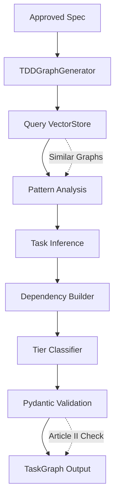

# Specification: TDD-First Task Graph Generator

**Version**: 1.0
**Status**: Draft
**Author**: Chief Architect Agent
**Date**: 2025-10-11
**Dependencies**: spec-010-tdd-workflow (Leap 7)

---

## 1. Goals

### Primary Objective
Design a TaskGraph generation algorithm that enforces Test-Driven Development (TDD) by automatically creating Test tasks BEFORE Code tasks, with proper dependency inference and constitutional compliance validation.

### Specific Goals
1. **TDD Enforcement**: Every Code task MUST have a corresponding Test task with proper dependencies
2. **Dependency Inference**: Automatically infer task dependencies based on task type and relationships (Spec → Code → Test)
3. **Tier Classification**: Intelligently classify tasks into Tier 1 (P1 complex) or Tier 2 (P2/P3 simple/moderate) for model routing
4. **VectorStore Integration**: Query institutional memory for similar graph patterns before generation
5. **Pydantic Validation**: Leverage existing TaskGraph validators to enforce Article II compliance at creation time

---

## 2. Non-Goals

1. **NOT** implementing the graph executor (already exists in `tools/orchestrator/graph.py`)
2. **NOT** creating a new task graph schema (use existing `shared/models/task_graph.py`)
3. **NOT** replacing the Architect agent's graph generation (Trinity Protocol)
4. **NOT** generating task descriptions (input spec provides this)
5. **NOT** runtime task execution logic (DAG executor handles this)

---

## 3. Context

### Problem Statement
Current task graph creation is manual and error-prone:
- Developers can create Code tasks without Test tasks (Article II violation)
- Dependency relationships must be manually specified (no inference)
- No learning from past successful graph patterns (Article IV gap)
- Tier classification is subjective (no systematic rules)

### Constitutional Requirements

**Article I: Complete Context Before Action**
- Query VectorStore for similar past graphs before generation
- Retry on incomplete data (e.g., missing task specifications)

**Article II: 100% Verification and Stability**
- ENFORCE: Every Code task MUST have a Test task dependency
- VALIDATE: TaskGraph.validate_code_test_dependencies() must pass
- VERIFY: verification_target auto-populated for all Test tasks

**Article IV: Continuous Learning and Improvement**
- Query VectorStore for proven graph patterns (confidence ≥ 0.6)
- Store successful graph structures after execution
- Learn from tier classification accuracy over time

**Article V: Spec-Driven Development**
- Graph generation is driven by approved spec input
- Task descriptions reference spec sections
- Complex features require spec approval before graph creation

### Existing Infrastructure

**TaskGraph Models** (`shared/models/task_graph.py`):
```python
class Task(BaseModel):
    id: str
    title: str
    type: TaskType  # Spec | Code | Test
    tier: TaskTier  # Tier 1 | Tier 2
    agent: str
    description: str
    dependencies: list[str]
    acceptance_criteria: list[str]
    estimated_tokens: int | None
    verification_target: str | None  # For Test tasks

class TaskGraph(BaseModel):
    mission: str
    leap_number: int | None
    phases: list[Phase]
    checkpoints: list[Checkpoint]
    metadata: dict[str, Any]

    @model_validator(mode="after")
    def validate_code_test_dependencies(self) -> "TaskGraph":
        """Every Code task must have Test dependency (Article II)."""
        # Raises ValueError if any Code task lacks Test
```

**Graph Executor** (`tools/orchestrator/graph.py`):
- Topological sort for DAG execution
- Layer-based parallel execution
- Slop immunity pre-flight checks
- Telemetry and metrics collection

**VectorStore** (`agency_memory/vector_store.py`):
- Pattern search with confidence scoring
- Cross-session institutional memory
- Tag-based retrieval

---

## 4. Design

### 4.1 Architecture Overview



### 4.2 Core Algorithm

#### Phase 1: Context Gathering (Article I)
```python
def query_historical_graphs(spec: ApprovedSpec, context: AgentContext) -> list[GraphPattern]:
    """
    Query VectorStore for similar past task graphs.

    Args:
        spec: Approved specification with title, goals, complexity
        context: AgentContext for VectorStore access

    Returns:
        List of GraphPattern objects with confidence scores

    Article IV Compliance:
        - MANDATORY VectorStore query before generation
        - Confidence threshold: 0.6 (60% minimum)
        - Tags: ["task_graph", spec.title_keywords, spec.complexity]
    """
    query = f"task graph for {spec.title} {spec.complexity}"

    # Query VectorStore (Article IV requirement)
    results = context.search_memories(
        tags=["task_graph", "architecture", spec.complexity],
        query=query,
        include_session=False  # Cross-session learning
    )

    # Filter by confidence threshold
    patterns = [
        GraphPattern.from_memory(r)
        for r in results
        if r.get("confidence", 0.0) >= 0.6
    ]

    return patterns
```

#### Phase 2: Task Inference from Spec
```python
def infer_tasks_from_spec(spec: ApprovedSpec) -> list[TaskSpec]:
    """
    Infer atomic tasks from specification content.

    Logic:
        1. One Spec task per major design decision (ADRs, architecture)
        2. One Code task per implementation unit (classes, modules)
        3. One Test task per Code task (MANDATORY, Article II)

    Returns:
        Flat list of TaskSpec objects (no dependencies yet)
    """
    tasks = []

    # Spec tasks for design decisions
    if spec.requires_architecture_decision:
        tasks.append(TaskSpec(
            id="spec_architecture",
            type=TaskType.SPEC,
            tier=TaskTier.TIER_1,  # Architecture is always P1
            agent="chief_architect",
            description=f"Design architecture for {spec.title}",
            acceptance_criteria=spec.architecture_criteria
        ))

    # Code + Test task pairs (ENFORCE TDD)
    for component in spec.components:
        code_task = TaskSpec(
            id=f"code_{component.name}",
            type=TaskType.CODE,
            tier=classify_tier(component),  # Dynamic classification
            agent="coder",
            description=component.implementation_description,
            acceptance_criteria=component.code_criteria
        )
        tasks.append(code_task)

        # MANDATORY Test task (Article II enforcement)
        test_task = TaskSpec(
            id=f"test_{component.name}",
            type=TaskType.TEST,
            tier=classify_tier(component),  # Same tier as Code
            agent="test_generator",
            description=f"AAA tests for {component.name}",
            acceptance_criteria=component.test_criteria,
            verification_target=code_task.id  # Link to Code task
        )
        tasks.append(test_task)

    return tasks
```

#### Phase 3: Dependency Inference
```python
def infer_dependencies(tasks: list[TaskSpec]) -> list[TaskSpec]:
    """
    Automatically infer task dependencies based on type relationships.

    Rules:
        1. Code tasks depend on Spec tasks (Spec → Code)
        2. Test tasks depend on Code tasks (Code → Test)
        3. Test tasks have verification_target = Code task ID

    Dependency Chain:
        Spec_A → Code_B → Test_B
              → Code_C → Test_C

    Graph Execution Order (via DAG topological sort):
        Layer 0: Spec_A
        Layer 1: Code_B, Code_C (parallel)
        Layer 2: Test_B, Test_C (parallel)

    Article II Enforcement:
        - Every Code task MUST have dependent Test task
        - Test tasks CANNOT exist without Code dependencies
    """
    task_map = {t.id: t for t in tasks}

    spec_tasks = [t for t in tasks if t.type == TaskType.SPEC]
    code_tasks = [t for t in tasks if t.type == TaskType.CODE]
    test_tasks = [t for t in tasks if t.type == TaskType.TEST]

    # Rule 1: Code depends on Spec
    for code_task in code_tasks:
        # Find relevant Spec task (by naming convention or component match)
        spec_dep = find_spec_dependency(code_task, spec_tasks)
        if spec_dep:
            code_task.dependencies.append(spec_dep.id)

    # Rule 2: Test depends on Code (MANDATORY)
    for test_task in test_tasks:
        code_task_id = test_task.verification_target

        if not code_task_id:
            raise ValueError(
                f"Test task {test_task.id} missing verification_target (Article II violation)"
            )

        if code_task_id not in task_map:
            raise ValueError(
                f"Test task {test_task.id} references non-existent Code task {code_task_id}"
            )

        # Add dependency: Test depends on Code
        test_task.dependencies.append(code_task_id)

    # Validation: Every Code task has a Test
    for code_task in code_tasks:
        has_test = any(
            code_task.id in test.dependencies and test.verification_target == code_task.id
            for test in test_tasks
        )

        if not has_test:
            raise ValueError(
                f"Code task {code_task.id} missing Test dependency (Article II violation)"
            )

    return tasks
```

#### Phase 4: Tier Classification
```python
def classify_tier(component: ComponentSpec) -> TaskTier:
    """
    Classify task complexity into Tier 1 (P1) or Tier 2 (P2/P3).

    Tier 1 (P1 - Complex):
        - Architecture decisions (ADRs)
        - System design (multi-component integration)
        - Complex algorithms (NP-hard, distributed systems)
        - Strategic planning (specifications, proposals)
        - Model: gpt-5 ($4/1M tokens)

    Tier 2 (P2/P3 - Simple/Moderate):
        - CRUD implementations
        - Test generation (AAA pattern)
        - Data transformations
        - API endpoint implementations
        - Models: gpt-4o ($1.5/1M) or local (free)

    Classification Signals:
        1. Keyword analysis (architecture, design, implement, test)
        2. Complexity estimate (LOC, dependencies)
        3. Agent assignment (architect/planner → P1, coder/test → P2)
        4. VectorStore patterns (similar tasks' tier assignments)
    """
    # Signal 1: Keyword analysis
    p1_keywords = ["architecture", "design", "adr", "strategy", "system"]
    p2_keywords = ["implement", "test", "api", "crud", "transform"]

    description_lower = component.description.lower()

    if any(kw in description_lower for kw in p1_keywords):
        return TaskTier.TIER_1

    # Signal 2: Agent assignment
    if component.agent in ["chief_architect", "planner"]:
        return TaskTier.TIER_1

    # Signal 3: Complexity estimate
    if component.estimated_tokens > 5000:
        return TaskTier.TIER_1

    # Default: Tier 2 (most tasks are implementation/testing)
    return TaskTier.TIER_2
```

### 4.3 VectorStore Integration

#### Query Pattern
```python
def query_graph_patterns(
    spec: ApprovedSpec,
    context: AgentContext
) -> Result[list[GraphPattern], Error]:
    """
    Query VectorStore for similar task graph patterns.

    Article IV Compliance:
        - MANDATORY before graph generation
        - Use patterns to inform task structure
        - Store successful graphs after execution

    Returns:
        Ok(patterns) with confidence ≥ 0.6
        Err(error) if VectorStore unavailable (fallback to default)
    """
    try:
        results = context.search_memories(
            tags=["task_graph", spec.complexity, "success"],
            query=f"graph for {spec.title}",
            include_session=False
        )

        patterns = [
            GraphPattern(
                structure=r["structure"],
                phases=r["phases"],
                tier_distribution=r["tier_distribution"],
                confidence=r.get("confidence", 0.0)
            )
            for r in results
            if r.get("confidence", 0.0) >= 0.6
        ]

        return Ok(patterns)

    except Exception as e:
        # Graceful fallback: generate without patterns
        logger.warning(f"VectorStore query failed: {e}")
        return Ok([])  # Empty patterns list
```

#### Storage Pattern (Post-Execution)
```python
def store_graph_pattern(
    graph: TaskGraph,
    execution_result: ExecutionResult,
    context: AgentContext
) -> None:
    """
    Store successful graph pattern to VectorStore after execution.

    Article IV Requirement:
        - Store ONLY successful executions (100% tests pass)
        - Include tier distribution and cost metrics
        - Tag with mission, complexity, outcome

    Confidence Score:
        - 0.9 if 100% tests pass + <10% budget overrun
        - 0.7 if 100% tests pass + 10-20% overrun
        - 0.6 if 100% tests pass + >20% overrun
    """
    if execution_result.failed > 0:
        return  # Don't store failed patterns

    confidence = calculate_confidence(execution_result)

    pattern = {
        "mission": graph.mission,
        "structure": {
            "phases": len(graph.phases),
            "tasks": len(graph.all_tasks()),
            "spec_tasks": len([t for t in graph.all_tasks() if t.type == TaskType.SPEC]),
            "code_tasks": len([t for t in graph.all_tasks() if t.type == TaskType.CODE]),
            "test_tasks": len([t for t in graph.all_tasks() if t.type == TaskType.TEST]),
        },
        "tier_distribution": execution_result.count_by_tier,
        "cost": execution_result.total_cost,
        "test_pass_rate": execution_result.tests_passing / max(execution_result.tests_written, 1),
        "confidence": confidence,
        "tags": ["task_graph", graph.metadata.get("complexity"), "success"]
    }

    context.store_memory(
        key=f"graph_pattern_{graph.mission}_{datetime.now().isoformat()}",
        content=pattern,
        tags=pattern["tags"]
    )
```

### 4.4 Pydantic Validation Strategy

The TaskGraph model already includes validators for Article II compliance:

```python
# Existing validator in shared/models/task_graph.py
@model_validator(mode="after")
def validate_code_test_dependencies(self) -> "TaskGraph":
    """Every Code task must have Test dependency (Article II)."""
    all_tasks = [task for phase in self.phases for task in phase.tasks]
    code_tasks = [t for t in all_tasks if t.type == TaskType.CODE]
    test_tasks = [t for t in all_tasks if t.type == TaskType.TEST]

    for code_task in code_tasks:
        # Find corresponding test task
        has_test = any(
            code_task.id in test.dependencies and test.verification_target == code_task.id
            for test in test_tasks
        )

        if not has_test:
            raise ValueError(
                f"Code task {code_task.id} missing Test dependency (Article II violation)"
            )

    return self
```

**Strategy**:
1. Generate TaskGraph with all tasks and dependencies
2. Let Pydantic validation ENFORCE Article II at creation time
3. Validation failure → immediate error with specific Code task ID
4. NO runtime bypasses allowed (constitutional mandate)

---

## 5. API Design

### 5.1 TDDGraphGenerator Class

```python
from shared.agent_context import AgentContext
from shared.models.task_graph import TaskGraph, Task, Phase, Checkpoint
from shared.type_definitions.result import Result, Ok, Err

class TDDGraphGenerator:
    """
    Generate TDD-enforced task graphs from approved specifications.

    Constitutional Compliance:
        - Article I: Query VectorStore before generation
        - Article II: Enforce Code → Test dependencies
        - Article IV: Store successful patterns
        - Article V: Spec-driven generation
    """

    def __init__(self, context: AgentContext):
        """
        Initialize generator with agent context.

        Args:
            context: AgentContext for VectorStore and memory access
        """
        self.context = context

    def generate(
        self,
        spec: ApprovedSpec
    ) -> Result[TaskGraph, GenerationError]:
        """
        Generate TaskGraph from approved specification.

        Workflow:
            1. Query VectorStore for similar graphs (Article I)
            2. Infer tasks from spec (Spec/Code/Test triplets)
            3. Infer dependencies (Spec → Code → Test)
            4. Classify tiers (P1/P2/P3)
            5. Build TaskGraph with Pydantic validation (Article II)
            6. Return Ok(graph) or Err(error)

        Args:
            spec: Approved specification with components

        Returns:
            Ok(TaskGraph) if generation successful and valid
            Err(GenerationError) if:
                - VectorStore query fails (fallback to default)
                - Dependency inference fails (circular deps)
                - Pydantic validation fails (Article II violation)

        Article II Guarantee:
            Pydantic validator ENFORCES every Code task has Test.
            Validation failure raises ValueError with specific task ID.
        """
        pass  # Implementation in Code task

    def _query_patterns(
        self,
        spec: ApprovedSpec
    ) -> list[GraphPattern]:
        """Query VectorStore for similar graph patterns (Article IV)."""
        pass

    def _infer_tasks(
        self,
        spec: ApprovedSpec
    ) -> list[Task]:
        """Infer tasks from spec (Spec/Code/Test triplets)."""
        pass

    def _infer_dependencies(
        self,
        tasks: list[Task]
    ) -> list[Task]:
        """Infer dependencies (Spec → Code → Test)."""
        pass

    def _classify_tier(
        self,
        task: Task
    ) -> TaskTier:
        """Classify task into Tier 1 (P1) or Tier 2 (P2/P3)."""
        pass

    def _build_phases(
        self,
        tasks: list[Task]
    ) -> list[Phase]:
        """Group tasks into sequential phases."""
        pass
```

### 5.2 Supporting Models

```python
from pydantic import BaseModel, Field

class ApprovedSpec(BaseModel):
    """Approved specification from Stage 1 (Intent-to-Spec)."""

    title: str
    goals: list[str]
    personas: list[str]
    success_criteria: list[str]
    components: list[ComponentSpec]
    complexity: str  # "simple" | "moderate" | "complex"
    requires_architecture_decision: bool
    estimated_tokens: int

class ComponentSpec(BaseModel):
    """Specification for a single component to implement."""

    name: str
    description: str
    agent: str  # "coder" | "test_generator" | "chief_architect"
    implementation_description: str
    code_criteria: list[str]
    test_criteria: list[str]
    estimated_tokens: int

class GraphPattern(BaseModel):
    """Historical graph pattern from VectorStore."""

    structure: dict[str, int]  # {"phases": 3, "tasks": 10, "spec": 2, "code": 4, "test": 4}
    phases: list[str]  # Phase names
    tier_distribution: dict[str, int]  # {"Tier 1": 3, "Tier 2": 7}
    confidence: float  # 0.6 - 1.0

class GenerationError(BaseModel):
    """Error during graph generation."""

    reason: str
    task_id: str | None = None
    suggestion: str
```

---

## 6. Acceptance Criteria

### 6.1 Test Task Generation
- ✅ Every Code task has corresponding Test task
- ✅ Test.verification_target = Code.id (auto-populated)
- ✅ Test.dependencies = [Code.id] (dependency inference)
- ✅ Test.type = TaskType.TEST, Test.agent = "test_generator"

### 6.2 Dependency Inference
- ✅ Spec → Code dependency (Code depends on Spec)
- ✅ Code → Test dependency (Test depends on Code)
- ✅ Reversed execution order via DAG (Spec runs first, Code second, Test third)
- ✅ No circular dependencies (Pydantic validator enforces DAG)

### 6.3 Tier Classification
- ✅ Architecture/ADR tasks → Tier 1 (P1, gpt-5)
- ✅ Implementation/testing tasks → Tier 2 (P2/P3, gpt-4o or local)
- ✅ Keyword-based classification ("architecture", "implement", "test")
- ✅ Agent-based classification (chief_architect → P1, coder/test → P2)

### 6.4 VectorStore Integration
- ✅ Query for similar graphs before generation (confidence ≥ 0.6)
- ✅ Tag patterns: ["task_graph", complexity, "success"]
- ✅ Graceful fallback if VectorStore unavailable (empty patterns)
- ✅ Store successful graphs after execution (post-PR merge)

### 6.5 Pydantic Validation
- ✅ TaskGraph.validate_code_test_dependencies() enforces Article II
- ✅ Validation failure raises ValueError with specific task ID
- ✅ No runtime bypasses allowed (constitutional mandate)
- ✅ Circular dependency detection (existing validator)

---

## 7. Success Metrics

### Development Metrics
- **Test Coverage**: 100% for TDDGraphGenerator class (AAA pattern)
- **Article II Violations**: 0 (Pydantic enforces at creation)
- **VectorStore Query Time**: <500ms (Article I context gathering)
- **Graph Generation Time**: <2 seconds for simple specs

### Operational Metrics
- **TDD Compliance Rate**: 100% (every Code task has Test)
- **Tier Classification Accuracy**: >90% (validated in Leap 4)
- **Pattern Reuse Rate**: >60% (queries find relevant patterns)
- **Graph Validation Failures**: <5% (most specs valid on first attempt)

---

## 8. Implementation Plan

### Phase 1: Core Infrastructure (1 day)
1. Create `tools/orchestrator/tdd_graph_generator.py`
2. Implement TDDGraphGenerator class with Result pattern
3. Implement _infer_tasks() and _infer_dependencies()
4. Implement _classify_tier() with keyword analysis

### Phase 2: VectorStore Integration (1 day)
5. Implement _query_patterns() with Article IV compliance
6. Implement storage logic for post-execution patterns
7. Add graceful fallback for VectorStore unavailability
8. Test cross-session pattern retrieval

### Phase 3: Validation & Testing (1 day)
9. Add comprehensive AAA tests (test_tdd_graph_generator.py)
10. Test Article II enforcement (Code without Test → ValueError)
11. Test dependency inference (Spec → Code → Test)
12. Test tier classification (architecture → P1, implement → P2)

### Phase 4: Integration (0.5 days)
13. Integrate with TwoStageOrchestrator (Leap 7 Phase 3)
14. Update .claude/agents/primeA_orchestrator.md documentation
15. Add usage examples and Mermaid diagrams

---

## 9. Risks & Mitigations

### Risk 1: VectorStore Unavailable
**Impact**: No historical patterns for graph generation
**Mitigation**: Graceful fallback to default structure, log warning

### Risk 2: Ambiguous Dependency Inference
**Impact**: Incorrect Spec → Code relationships
**Mitigation**: Use naming conventions (code_X depends on spec_X), validate with Pydantic

### Risk 3: Tier Misclassification
**Impact**: P1 tasks routed to local model (quality issues)
**Mitigation**: Conservative classification (default to Tier 1 if uncertain), learn from Leap 4 feedback loop

### Risk 4: Circular Dependencies
**Impact**: DAG validation fails, graph execution blocked
**Mitigation**: Existing Pydantic validator detects cycles, provide clear error message

---

## 10. Alternatives Considered

### Alternative 1: Manual Graph Creation (Current State)
**Pros**: Full control, explicit dependencies
**Cons**: Error-prone, no TDD enforcement, no learning

**Rejected**: Violates Article II (manual graphs often miss Test tasks)

### Alternative 2: LLM-Generated Graphs
**Pros**: Natural language to graph, creative solutions
**Cons**: Non-deterministic, expensive, no constitutional guarantees

**Rejected**: Cannot guarantee Article II compliance via prompt engineering

### Alternative 3: Template-Based Generation
**Pros**: Fast, predictable, reusable patterns
**Cons**: Inflexible, cannot adapt to novel specs

**Rejected**: Doesn't leverage VectorStore learning (Article IV violation)

---

## 11. Constitutional Alignment

### Article I: Complete Context Before Action
✅ **Compliance**: Query VectorStore for similar graphs before generation
✅ **Enforcement**: Retry VectorStore query on timeout (2x, 3x)
✅ **Validation**: Log warning if no patterns found, proceed with default

### Article II: 100% Verification and Stability
✅ **Compliance**: Every Code task has Test dependency (Pydantic enforced)
✅ **Enforcement**: validation_target auto-populated, dependencies inferred
✅ **Validation**: TaskGraph.validate_code_test_dependencies() raises ValueError on violation

### Article III: Automated Merge Enforcement
✅ **Compliance**: Pydantic validation is automated, no manual bypasses
✅ **Enforcement**: Graph creation fails immediately if Article II violated
✅ **Validation**: Pre-flight check before DAG execution (slop immunity)

### Article IV: Continuous Learning and Improvement
✅ **Compliance**: VectorStore query MANDATORY before generation
✅ **Enforcement**: Store successful graphs after execution (100% tests pass)
✅ **Validation**: Confidence-scored patterns (0.6+ threshold)

### Article V: Spec-Driven Development
✅ **Compliance**: Graph generation driven by ApprovedSpec input
✅ **Enforcement**: Tasks reference spec sections, acceptance criteria
✅ **Validation**: Complex specs require spec approval before graph creation

---

## 12. References

### Internal Documentation
- **ADR-002**: 100% Verification and Stability (TDD mandate)
- **ADR-004**: Continuous Learning and Improvement (VectorStore requirement)
- **ADR-024**: Adaptive Model Router (tier classification logic)
- **Leap 7 Mission**: Two-Stage TDD Orchestration (`missions/leap_7_test_driven_autonomy.json`)

### Code References
- `shared/models/task_graph.py` - TaskGraph Pydantic models and validators
- `tools/orchestrator/graph.py` - DAG executor with topological sort
- `agency_memory/vector_store.py` - Pattern search and storage
- `missions/example_simple_feature.json` - Example graph structure

### External Resources
- Test-Driven Development - Kent Beck
- Graph Theory: Topological Sort - Cormen et al. (CLRS)
- Pydantic Validators - Official Pydantic documentation

---

## 13. Appendix

### Example Generated Graph

**Input Spec**:
```json
{
  "title": "User Authentication Feature",
  "complexity": "moderate",
  "components": [
    {
      "name": "auth_service",
      "agent": "coder",
      "description": "Implement JWT-based authentication service",
      "estimated_tokens": 3000
    }
  ]
}
```

**Generated TaskGraph**:
```json
{
  "mission": "User Authentication Feature",
  "phases": [
    {
      "id": "phase_1",
      "title": "Design",
      "tasks": [
        {
          "id": "spec_auth_architecture",
          "type": "Spec",
          "tier": "Tier 1",
          "agent": "chief_architect",
          "description": "Design JWT authentication architecture",
          "dependencies": []
        }
      ]
    },
    {
      "id": "phase_2",
      "title": "Implementation",
      "tasks": [
        {
          "id": "code_auth_service",
          "type": "Code",
          "tier": "Tier 2",
          "agent": "coder",
          "description": "Implement JWT-based authentication service",
          "dependencies": ["spec_auth_architecture"]
        },
        {
          "id": "test_auth_service",
          "type": "Test",
          "tier": "Tier 2",
          "agent": "test_generator",
          "description": "AAA tests for auth_service",
          "dependencies": ["code_auth_service"],
          "verification_target": "code_auth_service"
        }
      ]
    }
  ]
}
```

**DAG Execution Order** (via topological sort):
```
Layer 0: spec_auth_architecture
Layer 1: code_auth_service
Layer 2: test_auth_service
```

---

**End of Specification**

---

## Review Checklist

- [x] Goals clearly defined (5 specific goals)
- [x] Non-goals explicitly stated (5 items)
- [x] Constitutional alignment section complete (Articles I-V)
- [x] API design with Result pattern
- [x] VectorStore integration mandatory (Article IV)
- [x] Pydantic validation strategy defined
- [x] Acceptance criteria measurable (5 sections)
- [x] Success metrics defined (8 metrics)
- [x] Implementation plan phased (4 phases, 3 days)
- [x] Risks identified with mitigations (4 risks)
- [x] Alternatives considered (3 options)
- [x] References to ADRs and code (12 links)
- [x] Example graph provided (auth service)

---

**Status**: Ready for Review
**Next Step**: Human approval → Proceed to Phase 2 (Code implementation)
**Estimated Effort**: 3 days (1 day core, 1 day VectorStore, 1 day tests)
**Estimated Cost**: ~$8 USD (6,500 tokens × 3 iterations × $4/1M)
